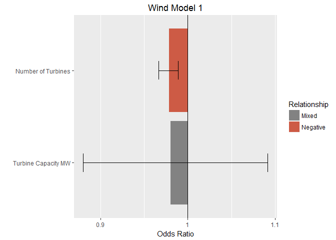
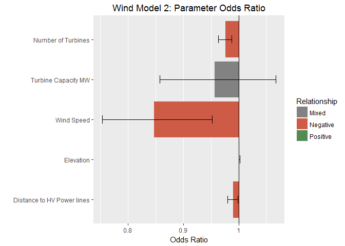
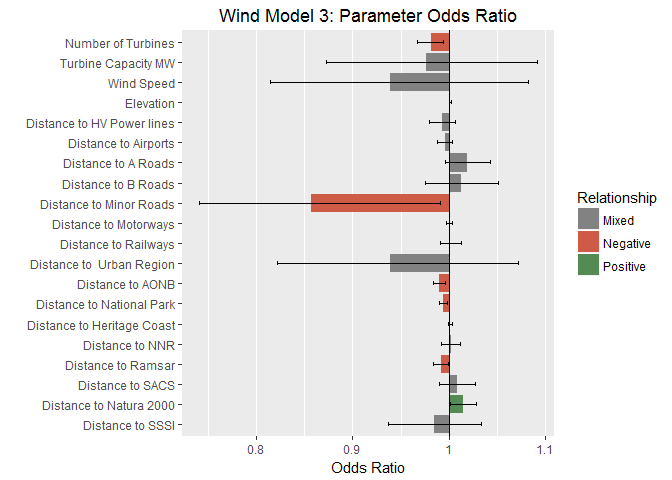
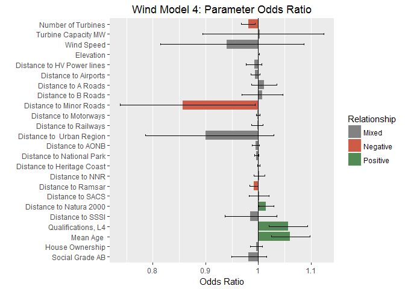
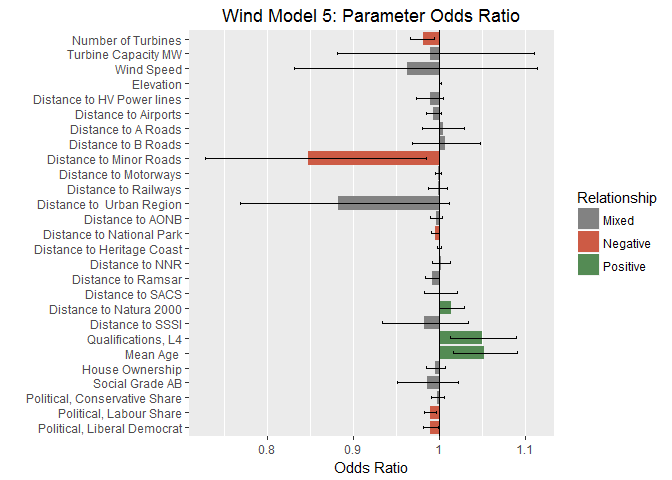
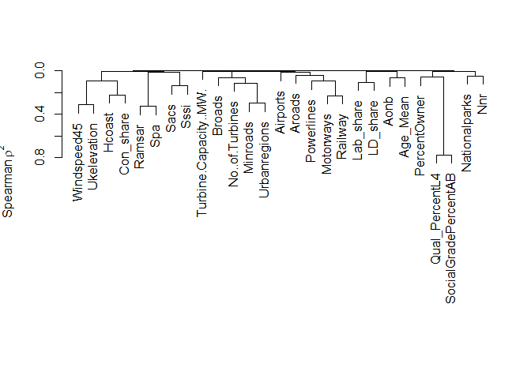

Hierarchical Model
================
Michael Harper
2017-02-09

This uses a hierarchical approach to build up the logistic regression model, assessing and refining the model at each stage. The addition of parameters to the model has been based on structured groups of parameters, with the order being based those which directly impact the site to the more abstract connections:

Script Purpose
==============

This script is conduct logistic regression analysis for onshore wind planning acceptance within the UK. This aims to establish whether modelling parameters used within onshore wind capacity assessments can be used as predictors for approval rates. The analysis is broken into the following key stages:

1.  A hierarchical approach is used to build a logistic regression model, with checks being made to
2.  After the initial check on parameters has been complete, segmenting of the data sets is explored to understand whether fits can be improved
3.  After the second stage of optimisation, the model is optimised to remove non-influential parameters.

Logistic Model
==============

The analysis will assess the match of fit by adding variables to the model and assessing whether there is an improved fit of the model. A full description of the method is provided in the associated report.

1.  **Physical attributes of the Site**: variables such as the number of turbines of the site, the installed capacity.
2.  **Proximity to Features**: inclusion of proximity to urban areas, wind speed, powerlines etc.
3.  **Environmental and Natural Designations**: This includes regions such as Areas of Outstanding Natural Beauty, National Parks etc.
4.  **Social and Census Data**: Demographic data for the area of the wind turbine, including age, level of qualifications.
5.  **Political Data**: Local authority composition at the time of the planning application, and share of the major political parties (Conservative, Labour and Liberal Democrats)

Model 1: Physical attributes of the plant
-----------------------------------------

This is based on some of the physical attributes of the wind turbines proposed. This includes the number of wind turbines of the site, and the turbine capacity which can be used to indicate the turbine size. The model initially included the overall wind farm capacity, however it was found that this was this was highly collinear with the number of turbines on the site. The capacity was therefore removed to reduce this influence on the model.

Parameters not included in this model but which could also be considered in a more detailed analysis would be 1) Wind turbine height 2) turbine colour. Such data was not available for the complete dataset.

The same code is used for each stage of the model to assess the fit. Comments will be provided for the first iteration to explain as required.

``` r
Model1Variables <- c("No..of.Turbines", "Turbine.Capacity..MW.")

# Custom function written to simplify the process of adding and removing variables from the model
WindModel1 <- LogisticModel(Model1Variables, TurbineData)

# Show summary results
(Model1Summary <- summary(WindModel1))
```

    ## 
    ## Call:
    ## glm(formula = Formula, family = binomial(), data = Dataframe)
    ## 
    ## Deviance Residuals: 
    ##    Min      1Q  Median      3Q     Max  
    ## -1.284  -1.237   1.058   1.118   2.700  
    ## 
    ## Coefficients:
    ##                        Estimate Std. Error z value Pr(>|z|)    
    ## (Intercept)            0.288064   0.120399   2.393 0.016730 *  
    ## No..of.Turbines       -0.021852   0.005849  -3.736 0.000187 ***
    ## Turbine.Capacity..MW. -0.019926   0.054886  -0.363 0.716574    
    ## ---
    ## Signif. codes:  0 '***' 0.001 '**' 0.01 '*' 0.05 '.' 0.1 ' ' 1
    ## 
    ## (Dispersion parameter for binomial family taken to be 1)
    ## 
    ##     Null deviance: 2043.9  on 1475  degrees of freedom
    ## Residual deviance: 2025.6  on 1473  degrees of freedom
    ## AIC: 2031.6
    ## 
    ## Number of Fisher Scoring iterations: 3

### Data Fit

The following plots shows the odds ratio for each predictor variable within the model, with the error bars showing the 95% confidence interval. If an indicator is greater than 1 then it indicates that as the predictor increases, the odds of the outcome occurring increase (that is, the wind farm is accepted). Conversely, a value less than 1 indicates that as the predictor increases, the odds of the outcome occurring decrease.

The error bars are useful to highlight the significance of the variable relationship to the model. if the CI passes 1, a statistically significant positive or negative relationship cannot be determined for the variable. The colour of the plot highlight this statistical significance.



### Diagnostics

Check to see whether regression model adequately represents the data.

``` r
LogisticDiagnostics(WindModel1)
```

    ## Chi Squared Test 
    ## Chi Squared               18.243 
    ## Df                        2 
    ## Chi Squared p             0 
    ##  
    ## Pseudo R^2 for logistic regression
    ## Hosmer and Lemeshow R^2   0.009 
    ## Cox and Snell R^2         0.012 
    ## Nagelkerke R^2            0.016 
    ##  
    ## Variance Inflation Factors: 
    ##       No..of.Turbines Turbine.Capacity..MW. 
    ##              1.024385              1.024385 
    ## 
    ##  Checking for potential issues: 
    ## No apparent issues with collinearityDurbin Watson Results: 
    ##  
    ##  lag Autocorrelation D-W Statistic p-value
    ##    1       0.9909951    0.01664797       0
    ##  Alternative hypothesis: rho != 0
    ## 
    ##  Is p-value greater than 0.05:             FALSE
    ##  Is DW ~ 2 (range of 0 to 4 acceptable):   TRUE

The Pseudo *R*<sup>2</sup> values highlight the relatively low level of the model. There are no issues with collinearity of the two variables or autocorrelation from the Durbin Watson Test.

### Checking Linearity

The interaction terms will be checked to see whether the variables are linear to the logit.

``` r
LogisticModelInt(Model1Variables, "Status.Summary", TurbineData)
```

    ## Statistically significant parameters from Logarithmic Transformations:

The logarithmic transformations are not statistically significant, which suggest that there are no issues with the linearity.

------------------------------------------------------------------------

Model 2: Developer Parameters
-----------------------------

The second model considers parameters which may be of interest to a developer, such as the site wind speed, proximity to powerlines and urban areas.

``` r
# "ParameterUpdate" is a custom function to update the parameter list. Arguments of "Add" and "Remove"
Model2Variables <- ParameterUpdate(input = Model1Variables, add = c("Windspeed45", "Ukelevation", "Powerlines"))

WindModel2 <- LogisticModel(Model2Variables, TurbineData)
(Model2Summary <- summary(WindModel2))
```

    ## 
    ## Call:
    ## glm(formula = Formula, family = binomial(), data = Dataframe)
    ## 
    ## Deviance Residuals: 
    ##     Min       1Q   Median       3Q      Max  
    ## -1.5072  -1.2160   0.9678   1.1177   2.9235  
    ## 
    ## Coefficients:
    ##                        Estimate Std. Error z value Pr(>|z|)    
    ## (Intercept)            1.426487   0.426175   3.347 0.000816 ***
    ## No..of.Turbines       -0.024386   0.006550  -3.723 0.000197 ***
    ## Turbine.Capacity..MW. -0.043929   0.055698  -0.789 0.430288    
    ## Windspeed45           -0.165628   0.059865  -2.767 0.005663 ** 
    ## Ukelevation            0.001181   0.000464   2.545 0.010941 *  
    ## Powerlines            -0.009560   0.004940  -1.935 0.052969 .  
    ## ---
    ## Signif. codes:  0 '***' 0.001 '**' 0.01 '*' 0.05 '.' 0.1 ' ' 1
    ## 
    ## (Dispersion parameter for binomial family taken to be 1)
    ## 
    ##     Null deviance: 2043.9  on 1475  degrees of freedom
    ## Residual deviance: 2007.2  on 1470  degrees of freedom
    ## AIC: 2019.2
    ## 
    ## Number of Fisher Scoring iterations: 4

### Data Fit

Check to see whether the model is a better fit of the data.



### Diagnostics

Check to see whether regression model adequately represents the data.

``` r
LogisticDiagnostics(WindModel2)
```

    ## Chi Squared Test 
    ## Chi Squared               36.658 
    ## Df                        5 
    ## Chi Squared p             0 
    ##  
    ## Pseudo R^2 for logistic regression
    ## Hosmer and Lemeshow R^2   0.018 
    ## Cox and Snell R^2         0.025 
    ## Nagelkerke R^2            0.033 
    ##  
    ## Variance Inflation Factors: 
    ##       No..of.Turbines Turbine.Capacity..MW.           Windspeed45 
    ##              1.188614              1.037185              1.480495 
    ##           Ukelevation            Powerlines 
    ##              1.587203              1.052746 
    ## 
    ##  Checking for potential issues: 
    ## No apparent issues with collinearityDurbin Watson Results: 
    ##  
    ##  lag Autocorrelation D-W Statistic p-value
    ##    1       0.9840599    0.03055331       0
    ##  Alternative hypothesis: rho != 0
    ## 
    ##  Is p-value greater than 0.05:             FALSE
    ##  Is DW ~ 2 (range of 0 to 4 acceptable):   TRUE

### Checking Linearity

The interaction terms will be checked to see whether the variables are linear to the logit.

``` r
LogisticModelInt(Model2Variables, "Status.Summary", TurbineData)
```

    ## Statistically significant parameters from Logarithmic Transformations: 
    ## Ukelevation, Powerlines, Ukelevation_Int, Powerlines_Int

### Model Outcomes

There is a relatively limited improvement in this model compared to the first model. Proximity to powerlines is seen as a significant parameter, however there appear to be issues with its linearity to the logit.

------------------------------------------------------------------------

Model 3: Proximity to Features
------------------------------

This model builds upon the previous models to include the full list of geospatial parameters derived in the previous analysis. These provide the proximity to the nearest features and include landscape and environmental designations.

``` r
Model3Variables <- ParameterUpdate(Model2Variables, add = c( "Airports", "Aroads", "Broads", "Minroads", "Motorways",  "Railway", "Urbanregions", "Aonb", "Nationalparks", "Hcoast", "Nnr", "Ramsar", "Sacs", "Spa", "Sssi"))


WindModel3 <- LogisticModel(Model3Variables, TurbineData)
(Model3Summary <- summary(WindModel3))
```

    ## 
    ## Call:
    ## glm(formula = Formula, family = binomial(), data = Dataframe)
    ## 
    ## Deviance Residuals: 
    ##     Min       1Q   Median       3Q      Max  
    ## -1.6130  -1.1880   0.8615   1.1002   2.5984  
    ## 
    ## Coefficients:
    ##                         Estimate Std. Error z value Pr(>|z|)   
    ## (Intercept)            1.234e+00  5.222e-01   2.363  0.01814 * 
    ## No..of.Turbines       -1.914e-02  6.930e-03  -2.762  0.00574 **
    ## Turbine.Capacity..MW. -2.426e-02  5.693e-02  -0.426  0.67002   
    ## Windspeed45           -6.327e-02  7.254e-02  -0.872  0.38314   
    ## Ukelevation            9.862e-04  6.715e-04   1.469  0.14192   
    ## Powerlines            -6.746e-03  6.923e-03  -0.974  0.32984   
    ## Airports              -4.358e-03  4.144e-03  -1.051  0.29305   
    ## Aroads                 1.879e-02  1.177e-02   1.596  0.11054   
    ## Broads                 1.216e-02  1.907e-02   0.638  0.52365   
    ## Minroads              -1.539e-01  7.421e-02  -2.074  0.03806 * 
    ## Motorways             -5.339e-05  1.578e-03  -0.034  0.97301   
    ## Railway                1.573e-03  5.484e-03   0.287  0.77418   
    ## Urbanregions          -6.325e-02  6.751e-02  -0.937  0.34879   
    ## Aonb                  -1.033e-02  3.372e-03  -3.064  0.00219 **
    ## Nationalparks         -6.010e-03  2.049e-03  -2.934  0.00335 **
    ## Hcoast                 9.260e-04  1.183e-03   0.783  0.43386   
    ## Nnr                    1.785e-03  5.131e-03   0.348  0.72795   
    ## Ramsar                -8.502e-03  4.122e-03  -2.063  0.03916 * 
    ## Sacs                   8.032e-03  9.428e-03   0.852  0.39429   
    ## Spa                    1.436e-02  6.881e-03   2.087  0.03693 * 
    ## Sssi                  -1.598e-02  2.507e-02  -0.637  0.52396   
    ## ---
    ## Signif. codes:  0 '***' 0.001 '**' 0.01 '*' 0.05 '.' 0.1 ' ' 1
    ## 
    ## (Dispersion parameter for binomial family taken to be 1)
    ## 
    ##     Null deviance: 2043.9  on 1475  degrees of freedom
    ## Residual deviance: 1969.7  on 1455  degrees of freedom
    ## AIC: 2011.7
    ## 
    ## Number of Fisher Scoring iterations: 4

### Data Fit

Check to see whether the model is a better fit of the data.



### Diagnostics

Check to see whether regression model adequately represents the data.

``` r
LogisticDiagnostics(WindModel3)
```

    ## Chi Squared Test 
    ## Chi Squared               74.194 
    ## Df                        20 
    ## Chi Squared p             0 
    ##  
    ## Pseudo R^2 for logistic regression
    ## Hosmer and Lemeshow R^2   0.036 
    ## Cox and Snell R^2         0.049 
    ## Nagelkerke R^2            0.065 
    ##  
    ## Variance Inflation Factors: 
    ##       No..of.Turbines Turbine.Capacity..MW.           Windspeed45 
    ##              1.328213              1.059754              2.118352 
    ##           Ukelevation            Powerlines              Airports 
    ##              3.243939              1.910945              1.252196 
    ##                Aroads                Broads              Minroads 
    ##              1.286063              1.372877              1.987102 
    ##             Motorways               Railway          Urbanregions 
    ##              3.740575              2.586490              2.357963 
    ##                  Aonb         Nationalparks                Hcoast 
    ##              1.309328              2.111770              3.460906 
    ##                   Nnr                Ramsar                  Sacs 
    ##              1.746713              1.827597              1.605919 
    ##                   Spa                  Sssi 
    ##              1.849581              1.157819 
    ## 
    ##  Checking for potential issues: 
    ## No apparent issues with collinearityDurbin Watson Results: 
    ##  
    ##  lag Autocorrelation D-W Statistic p-value
    ##    1       0.9713802    0.05603684       0
    ##  Alternative hypothesis: rho != 0
    ## 
    ##  Is p-value greater than 0.05:             FALSE
    ##  Is DW ~ 2 (range of 0 to 4 acceptable):   TRUE

### Checking Linearity

``` r
LogisticModelInt(Model3Variables, "Status.Summary", TurbineData)
```

    ## Statistically significant parameters from Logarithmic Transformations: 
    ## Aonb, Aonb_Int

### Model Outcomes

Areas of Outstanding Natural Beauty (AONB), National Parks and SPAs are statistically significant environmental and landscape designations. However it appears that there may be issues with AoNB linearity.

------------------------------------------------------------------------

Model 4: Census Variables
-------------------------

This model adds Census data to understand whether demographic variables can be linked to the turbines. Census data was allocated according to the boundaries of the Lower Super Output Area (LSOA) for England and Wale, and Data Zones for Scotland. Variables included are:

1.  Qualifications: Percentage of Population with Level 4 Qualification.
2.  Age: Mean and Median Age
3.  Social Grade: Percentage of Population Class A or B (Managerial, Administrative or Professional)
4.  Tenure: Percentage of Houses Owned

Considered but not included:

1.  Index of Multiple Deprivation: Not possible to draw a comparison across the UK as differing methodologies are used in Scotland, Wales and England.

``` r
Model4Variables <- ParameterUpdate(Model3Variables, add = c("Qual_PercentL4", "Age_Mean", "PercentOwner", "SocialGradePercentAB"))

WindModel4 <- LogisticModel(Model4Variables, TurbineData)
(Model4Summary <- summary(WindModel4))
```

    ## 
    ## Call:
    ## glm(formula = Formula, family = binomial(), data = Dataframe)
    ## 
    ## Deviance Residuals: 
    ##     Min       1Q   Median       3Q      Max  
    ## -1.7389  -1.1364   0.7411   1.0814   2.5826  
    ## 
    ## Coefficients:
    ##                         Estimate Std. Error z value Pr(>|z|)    
    ## (Intercept)           -2.0743737  0.9537093  -2.175  0.02963 *  
    ## No..of.Turbines       -0.0188232  0.0070957  -2.653  0.00798 ** 
    ## Turbine.Capacity..MW.  0.0024489  0.0581830   0.042  0.96643    
    ## Windspeed45           -0.0614959  0.0735832  -0.836  0.40331    
    ## Ukelevation            0.0009065  0.0006837   1.326  0.18486    
    ## Powerlines            -0.0078704  0.0076871  -1.024  0.30590    
    ## Airports              -0.0057412  0.0043615  -1.316  0.18806    
    ## Aroads                 0.0105259  0.0121182   0.869  0.38507    
    ## Broads                 0.0069830  0.0195544   0.357  0.72101    
    ## Minroads              -0.1547451  0.0760435  -2.035  0.04186 *  
    ## Motorways             -0.0007679  0.0016576  -0.463  0.64318    
    ## Railway               -0.0019864  0.0056990  -0.349  0.72742    
    ## Urbanregions          -0.1056354  0.0690214  -1.530  0.12590    
    ## Aonb                  -0.0053067  0.0035374  -1.500  0.13357    
    ## Nationalparks         -0.0034257  0.0021573  -1.588  0.11230    
    ## Hcoast                 0.0005214  0.0012216   0.427  0.66955    
    ## Nnr                    0.0014074  0.0053682   0.262  0.79319    
    ## Ramsar                -0.0081751  0.0041680  -1.961  0.04983 *  
    ## Sacs                   0.0012553  0.0096985   0.129  0.89702    
    ## Spa                    0.0145356  0.0069703   2.085  0.03704 *  
    ## Sssi                  -0.0154080  0.0255779  -0.602  0.54691    
    ## Qual_PercentL4         0.0545488  0.0176601   3.089  0.00201 ** 
    ## Age_Mean               0.0586514  0.0178242   3.291  0.00100 ***
    ## PercentOwner          -0.0036696  0.0057197  -0.642  0.52115    
    ## SocialGradePercentAB  -0.0187800  0.0172017  -1.092  0.27494    
    ## ---
    ## Signif. codes:  0 '***' 0.001 '**' 0.01 '*' 0.05 '.' 0.1 ' ' 1
    ## 
    ## (Dispersion parameter for binomial family taken to be 1)
    ## 
    ##     Null deviance: 2043.9  on 1475  degrees of freedom
    ## Residual deviance: 1930.2  on 1451  degrees of freedom
    ## AIC: 1980.2
    ## 
    ## Number of Fisher Scoring iterations: 5

### Data Fit

Check to see whether the model is a better fit of the data.

``` r
#OddsTable(WindModel4, "Odds Table for Wind Model 4")
LogisticOddsPlot(WindModel4, Sort = FALSE, Title =  "Wind Model 4: Parameter Odds Ratio")
```



### Diagnostics

Check to see whether regression model adequately represents the data.

``` r
LogisticDiagnostics(WindModel4)
```

    ## Chi Squared Test 
    ## Chi Squared               113.653 
    ## Df                        24 
    ## Chi Squared p             0 
    ##  
    ## Pseudo R^2 for logistic regression
    ## Hosmer and Lemeshow R^2   0.056 
    ## Cox and Snell R^2         0.074 
    ## Nagelkerke R^2            0.099 
    ##  
    ## Variance Inflation Factors: 
    ##       No..of.Turbines Turbine.Capacity..MW.           Windspeed45 
    ##              1.330084              1.074119              2.119854 
    ##           Ukelevation            Powerlines              Airports 
    ##              3.290611              1.749218              1.362860 
    ##                Aroads                Broads              Minroads 
    ##              1.341442              1.408152              2.039079 
    ##             Motorways               Railway          Urbanregions 
    ##              3.946061              2.430402              2.391042 
    ##                  Aonb         Nationalparks                Hcoast 
    ##              1.396199              2.202052              3.561903 
    ##                   Nnr                Ramsar                  Sacs 
    ##              1.864692              1.831066              1.648213 
    ##                   Spa                  Sssi        Qual_PercentL4 
    ##              1.863108              1.171059              7.278490 
    ##              Age_Mean          PercentOwner  SocialGradePercentAB 
    ##              1.360079              1.398331              7.823204 
    ## 
    ##  Checking for potential issues: 
    ## No apparent issues with collinearityDurbin Watson Results: 
    ##  
    ##  lag Autocorrelation D-W Statistic p-value
    ##    1       0.9568062    0.08521783       0
    ##  Alternative hypothesis: rho != 0
    ## 
    ##  Is p-value greater than 0.05:             FALSE
    ##  Is DW ~ 2 (range of 0 to 4 acceptable):   TRUE

\*\*\* Checking Linearity

``` r
LogisticModelInt(Model4Variables, "Status.Summary", TurbineData)
```

    ## Statistically significant parameters from Logarithmic Transformations: 
    ## Aonb

### Model Outcomes

-   Increased levels of qualification appear to reduce the likelihood of acceptance
-   Age\_Median and Mean are highlight collinear. Median value removed

------------------------------------------------------------------------

Model 5: Political Parameters
-----------------------------

This adds information from local authority composition

``` r
Model5Variables <- ParameterUpdate(Model4Variables, add = c("Con_share", "Lab_share", "LD_share"))

WindModel5 <- LogisticModel(Model5Variables, TurbineData)
(Model5Summary <- summary(WindModel5))
```

    ## 
    ## Call:
    ## glm(formula = Formula, family = binomial(), data = Dataframe)
    ## 
    ## Deviance Residuals: 
    ##     Min       1Q   Median       3Q      Max  
    ## -1.7487  -1.1154   0.7427   1.0665   2.5742  
    ## 
    ## Coefficients:
    ##                         Estimate Std. Error z value Pr(>|z|)   
    ## (Intercept)           -1.155e+00  1.018e+00  -1.135  0.25632   
    ## No..of.Turbines       -1.928e-02  7.232e-03  -2.666  0.00769 **
    ## Turbine.Capacity..MW. -1.073e-02  5.855e-02  -0.183  0.85453   
    ## Windspeed45           -3.834e-02  7.467e-02  -0.513  0.60761   
    ## Ukelevation            1.044e-03  6.993e-04   1.493  0.13532   
    ## Powerlines            -1.006e-02  8.119e-03  -1.239  0.21541   
    ## Airports              -6.585e-03  4.398e-03  -1.497  0.13431   
    ## Aroads                 4.744e-03  1.232e-02   0.385  0.70023   
    ## Broads                 7.264e-03  1.973e-02   0.368  0.71276   
    ## Minroads              -1.654e-01  7.656e-02  -2.161  0.03073 * 
    ## Motorways             -1.057e-03  1.763e-03  -0.600  0.54860   
    ## Railway               -1.688e-03  5.771e-03  -0.293  0.76986   
    ## Urbanregions          -1.247e-01  6.986e-02  -1.785  0.07430 . 
    ## Aonb                  -3.842e-03  3.582e-03  -1.073  0.28345   
    ## Nationalparks         -4.655e-03  2.225e-03  -2.092  0.03643 * 
    ## Hcoast                -3.176e-05  1.309e-03  -0.024  0.98064   
    ## Nnr                    2.261e-03  5.481e-03   0.413  0.67988   
    ## Ramsar                -8.226e-03  4.235e-03  -1.942  0.05208 . 
    ## Sacs                   1.211e-03  9.772e-03   0.124  0.90138   
    ## Spa                    1.413e-02  7.062e-03   2.000  0.04545 * 
    ## Sssi                  -1.716e-02  2.587e-02  -0.663  0.50723   
    ## Qual_PercentL4         4.915e-02  1.843e-02   2.667  0.00765 **
    ## Age_Mean               5.138e-02  1.809e-02   2.840  0.00450 **
    ## PercentOwner          -4.367e-03  5.791e-03  -0.754  0.45083   
    ## SocialGradePercentAB  -1.448e-02  1.827e-02  -0.793  0.42783   
    ## Con_share             -1.780e-03  3.846e-03  -0.463  0.64344   
    ## Lab_share             -1.070e-02  3.772e-03  -2.838  0.00454 **
    ## LD_share              -1.005e-02  4.689e-03  -2.144  0.03206 * 
    ## ---
    ## Signif. codes:  0 '***' 0.001 '**' 0.01 '*' 0.05 '.' 0.1 ' ' 1
    ## 
    ## (Dispersion parameter for binomial family taken to be 1)
    ## 
    ##     Null deviance: 2043.9  on 1475  degrees of freedom
    ## Residual deviance: 1917.8  on 1448  degrees of freedom
    ## AIC: 1973.8
    ## 
    ## Number of Fisher Scoring iterations: 5

``` r
write.csv(x =  round(Model5Summary$coefficients, digits=3), file = "C:/Dropbox/001UniversityWork/PhD/Conference Papers/ECOS/Results/SummaryTable.csv")
```

### Data Fit

Check to see whether the model is a better fit of the data.

``` r
#OddsTable(WindModel5, "Odds Table for Wind Model 4")
LogisticOddsPlot(WindModel5, Sort = FALSE, Title = "Wind Model 5: Parameter Odds Ratio")
```



### Diagnostics

Check to see whether regression model adequately represents the data.

``` r
LogisticDiagnostics(WindModel5)
```

    ## Chi Squared Test 
    ## Chi Squared               126.116 
    ## Df                        27 
    ## Chi Squared p             0 
    ##  
    ## Pseudo R^2 for logistic regression
    ## Hosmer and Lemeshow R^2   0.062 
    ## Cox and Snell R^2         0.082 
    ## Nagelkerke R^2            0.109 
    ##  
    ## Variance Inflation Factors: 
    ##       No..of.Turbines Turbine.Capacity..MW.           Windspeed45 
    ##              1.339349              1.084531              2.166558 
    ##           Ukelevation            Powerlines              Airports 
    ##              3.418529              1.754873              1.371345 
    ##                Aroads                Broads              Minroads 
    ##              1.390526              1.422772              2.031497 
    ##             Motorways               Railway          Urbanregions 
    ##              4.407356              2.395278              2.403191 
    ##                  Aonb         Nationalparks                Hcoast 
    ##              1.413888              2.307822              4.053759 
    ##                   Nnr                Ramsar                  Sacs 
    ##              1.933458              1.876834              1.656940 
    ##                   Spa                  Sssi        Qual_PercentL4 
    ##              1.884752              1.186447              7.914339 
    ##              Age_Mean          PercentOwner  SocialGradePercentAB 
    ##              1.398998              1.427156              8.786084 
    ##             Con_share             Lab_share              LD_share 
    ##              3.280918              2.567157              1.606729 
    ## 
    ##  Checking for potential issues: 
    ## No apparent issues with collinearityDurbin Watson Results: 
    ##  
    ##  lag Autocorrelation D-W Statistic p-value
    ##    1       0.9518972    0.09499489       0
    ##  Alternative hypothesis: rho != 0
    ## 
    ##  Is p-value greater than 0.05:             FALSE
    ##  Is DW ~ 2 (range of 0 to 4 acceptable):   TRUE

A variable cluster plot can be used for assessing collinearity, redundancy, and for separating variables into clusters that can be scored as a single variable. The squared Spearman correlation coefficients are used to compare similarity.

``` r
VariableCluster(Model5Variables, TurbineData)
```



    ## NULL

### Checking Linearity

``` r
LogisticModelInt(Model5Variables, "Status.Summary", TurbineData)
```

    ## Statistically significant parameters from Logarithmic Transformations: 
    ## Turbine.Capacity..MW., Urbanregions, Age_Mean, Turbine.Capacity..MW._Int, Urbanregions_Int, Age_Mean_Int
