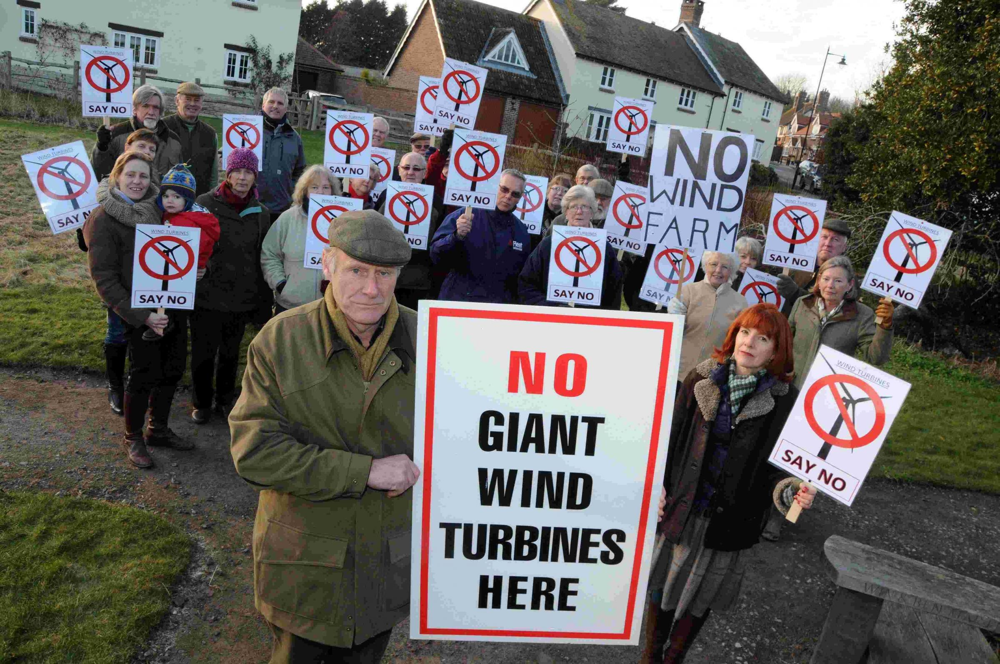
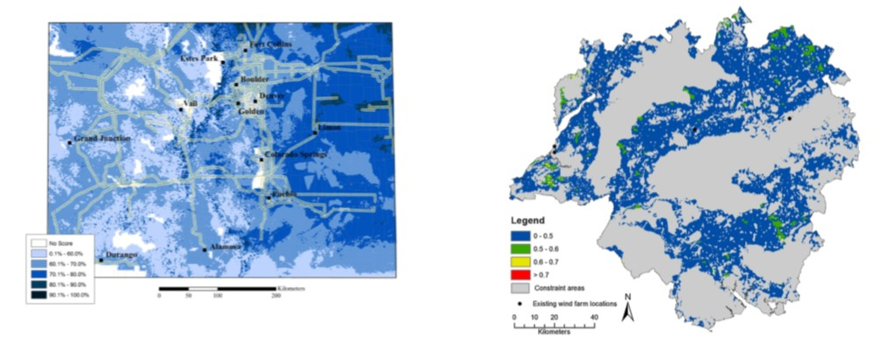
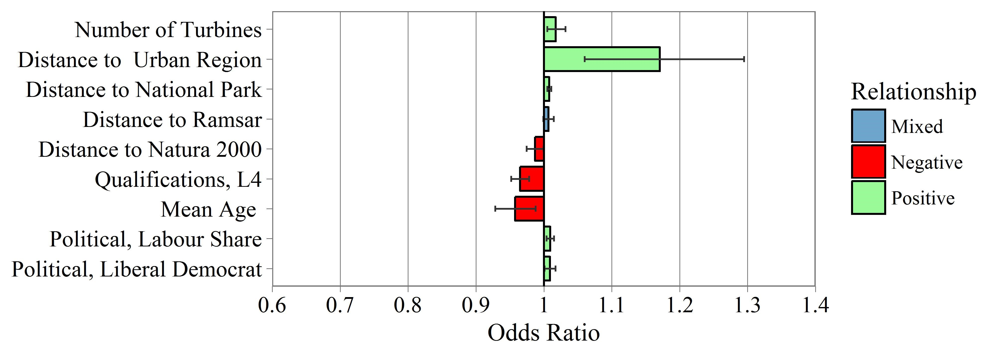
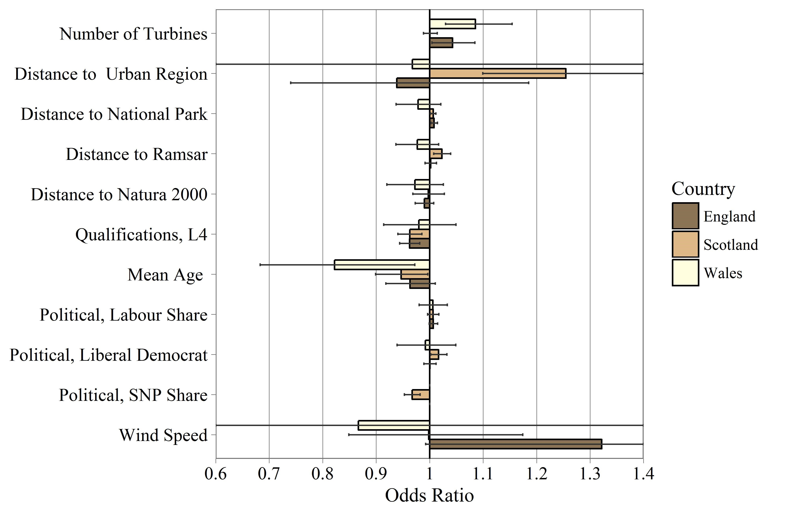
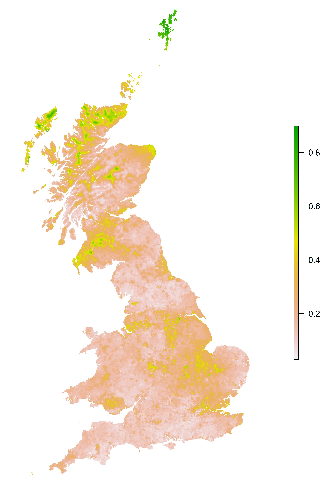
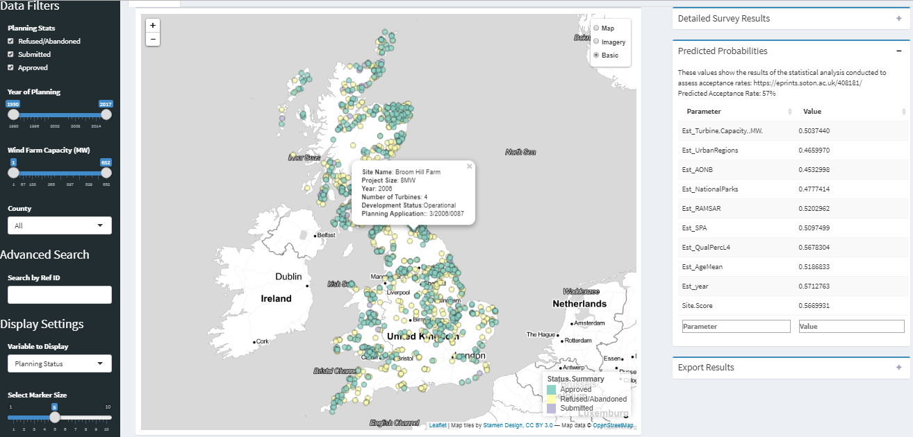

```{r setup, include=FALSE}
knitr::opts_chunk$set(echo = FALSE, out.width = "70%", fig.align = "center", message = FALSE, warning = FALSE)

# Load Relevant Packages
library(plotly) # Interactive graphs
library(knitr)
library(magrittr)
library(kableExtra)
library(DiagrammeR)
library(ggmap)
library(mapdata)
library(ggplot2)
```

## Background

- Onshore wind turbines provide key opportunity for decarbonisation
- High resource availability
- Low land usage
- Cost competitive against many conventional technologies
- Technology highly site specific

  

## What makes a good site?

Different actors consider different parameters:

**Site developers**

- Largely concerned about **Economic** parameters
- Site endowment
- Easy to calculate
  
**Local parties**

-  **Social** and **Environmental** concerns
- Visual intrusion of sites
- Difficult to assess impacts
    
## Wind Turbine Site Selection

```{r}

```

## Existing Research

Global research into identifying suitable turbine sites. 15 key studies identified since 2000.

```{r, out.width="60%"}

# Load Data and select countries
World <- map_data(map = "world")
World <- World[World$region != "Antarctica", ]
StudyRegions <- World[World$region == c("UK", "Iran", "Turkey", "USA", "Japan", "Austria", "Trinidad and Tobago", "Poland", "Taiwan", "Denmark", "Greece", "China"),]

mapview <- ggplot() + 
  geom_polygon(data = World, aes(x=long, y = lat, group = group), fill = "grey80", colour = "grey90", size = 0.25) + 
  geom_polygon(data = StudyRegions, aes(x=long, y = lat, group = group), fill = "springgreen4") + 
  theme_nothing() +
  theme(panel.background = element_rect(fill = 'gray99'),
        plot.margin = unit(c(0,0,0,0), "cm"),
        plot.background = element_rect(fill = "transparent", colour = NA)) +
  coord_fixed(1.3, expand = FALSE)

p1 <- ggplotly(mapview, width = "100%", height = "100%")
mapview

```

## Existing Research

- Extensive use of Geospatial Information Systems (GIS) to identify suitable sites
- Multi-criteria decision analysis (MCDA) used extensively to determine best options

```{r, fig.asp=0.2, fig.align = "center", out.width="100%"}

grViz('
      
digraph G {
graph[font = fontcm]
rankdir=LR

node [fontname = "helvetica", shape=box, style = filled, height = 0.8, fillcolor=WhiteSmoke, fontcolor = black, width = 1.5];
Input[label = "Select input \n parameters"]
Score[label = "Score each site \n against \n parameters"]
Weighting[label = "Assign \n weightings to \n each parameter"]
Suitability[label = "Calculate site \n suitability"]
Select[label = "Select suitable \n sites"]

Input -> Score -> Weighting -> Suitability -> Select

}

      
      ')
```

- Primarily based on geospatial parameters

## Example Studies

```{r, out.width="100%"}

```

<p style="font-size:12px">
[1] J. R. Janke, "Multicriteria GIS modeling of wind and solar farms in Colorado," Renew. Energy, vol. 35, pp. 2228-2234, 2010. <br>
[2] J. J. W. Watson and M. D. Hudson, "Regional Scale wind farm and solar farm suitability assessment using GIS-assisted multi-criteria evaluation," Landsc. Urban Plan., vol. 138, pp. 20-31, 2015.
</p>

## Development Patterns

```{r, out.width="75%", fig.asp=0.5, fig.align="center"}
AcceptancebyYear <- read.csv("figures/Acceptance.csv", check.names = FALSE)

library(ggplot2)
graph <- ggplot(data = AcceptancebyYear, aes(x = year, y = Percentage_Approved)) +
  geom_point() +
  stat_smooth() + 
  labs(x = "Year", y = "Planning Acceptance Rate, %", title = "Annual Turbine Acceptance Rates within the UK", 
       subtitle = "Percentage of planning applications which receive planning permission") +
  scale_x_continuous(breaks = seq(1992, 2016,2), limits = c(1992, 2018), expand = c(0,0.1))

graph
```

## Research Gap

Two key challenges were identified:

1. **Are we using the right parameters to assess site suitability?**
2. **Can we accurately predict the likelihood success rate based on geospatial parameters?**

# Research

## Research Approach

- Inverse/Retrospective GIS approach used to develop model parameters
- Logistic regression analysis used to assess influence of parameters

```{r out.width="100%", fig.align = "center", fig.asp= 0.5}

grViz('

digraph G {
bgcolor="transparent"
graph[font = fontcm]
node [fontname = "helvetica", shape=box, style = filled, fillcolor = WhiteSmoke, width = 1.4, height = 0.6 fontcolor = black];
rankdir=LR


Observed[label = "Observations", fillcolor = "#c7eae5"]
Model2[label = "Model", fillcolor = "#f6e8c3"]
Parameters2 [label = "Model \n Parameters", fillcolor = "#bebada"]

Observed -> Model2 -> Parameters2 [dir=backward]


Parameters[label = "Model \n Parameters", fillcolor = "#bebada"]
Model[label = "Model", fillcolor = "#f6e8c3"]
Results[label = "Predicted \n Results", fillcolor = "#c7eae5"]

Parameters -> Model -> Results

node [shape=plaintext, style = filled, fillcolor = none, width = 1.4 text = black, ];
Forward[label=< <B>Forward Theory</B> >]
Inverse[label=< <B>Inverse Theory</B> >]
Blank[label="       "]

Forward -> Parameters [style=invis]
Inverse -> Observed [style=invis]
Results -> Blank [style=invis]
}

')

```

## Turbine Data

```{r, fig.cap="Location of Wind Turbines used within the analysis", out.width="85%"}
include_graphics("figures/StudyExtent.jpg")
```

## Model Parameters

- 30 parameters gathered
- Parameters mapped to wind turbine sites.

```{r, fig.align="center", fig.height=3, fig.width= 3}

grViz('

digraph neato {
  bgcolor="transparent"
  size="7.75,10.25"
  graph [layout = neato, fontname = "helvetica", sep = 2]
  
  node [fontname = "helvetica", width = 1.5, height = 0.6, nodesep = 20, shape = ellipse, color = grey, style = filled, fixedsize = true]
  
  Turbine[label = "Wind \n Turbine \n Sites", fillcolor = LightGrey, height = 1.2, width = 1.2]
  
  node [fillcolor = PaleGoldenrod]
  t[label = "Site Data"]
  l[label = "Protected \n Landscapes"]
  d[label = "Demographic"]
  f[label= "Landscape \n Features"]
  n[label= "Nature \n Designations"]
  g[label = "Geographic"]
  p[label = "Political"]
  
  edge [color = grey, dir=back, len = 1.6]
  Turbine -> {t l d f n g p}

}

')
```

## Findings

- 9 parameters were found to be significant
- Optimisation of model to identify key parameters

```{r, out.width="100%"}

```

## Segmented Model

Second set of models built to explore whether there were regional differences in parameters.

```{r, out.width="60%"}

```

## Model Fit

```{r}
Results <- read.csv("figures/OddsTable.csv", check.names = FALSE)

knitr::kable(Results, format = "html")

```

## Model Generalisation

```{r, out.width="33%"}

```

# Implications

## Outcomes

- Range of siginficant parameters identified as significant within the analysis
- Quantitiatvely linked social characteristics to acceptance rates.
- Relatively poor model fit demonstrates issue of purely geospatial analysis 

## Future Work

**Model refinement**

  - Additional parameters added to the model
  - More detailed geospatial variance

**Applying findings**

  - Sensitivity integrated into a geospatial model for predicting sites
  - Can we understand where sites are best located?

**Dissemenation**

  - Academic
  - Local planners
  - Developers
  
## Future Work

Online tool for querying site data: https://mikeyharper.shinyapps.io/windturbinemap/ 
```{r}

```

## Thank You

- **Find out more**: Paper page 2217 of the proceedings
- **Paper also available online**: https://eprints.soton.ac.uk/408181/
- **Supporting Analysis**: https://github.com/mikey-harper/WindStatisticalAnalysis

<br>
<hr>
<br>
**Michael Harper** <br>
[Sustainable Energy Research Group](www.energy.soton.ac.uk), University of Southampton <br>
**Email**: m.harper@soton.ac.uk <br>
**Twitter**: @MikeyLHarper <br>

