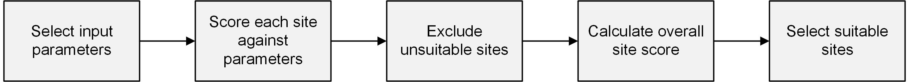
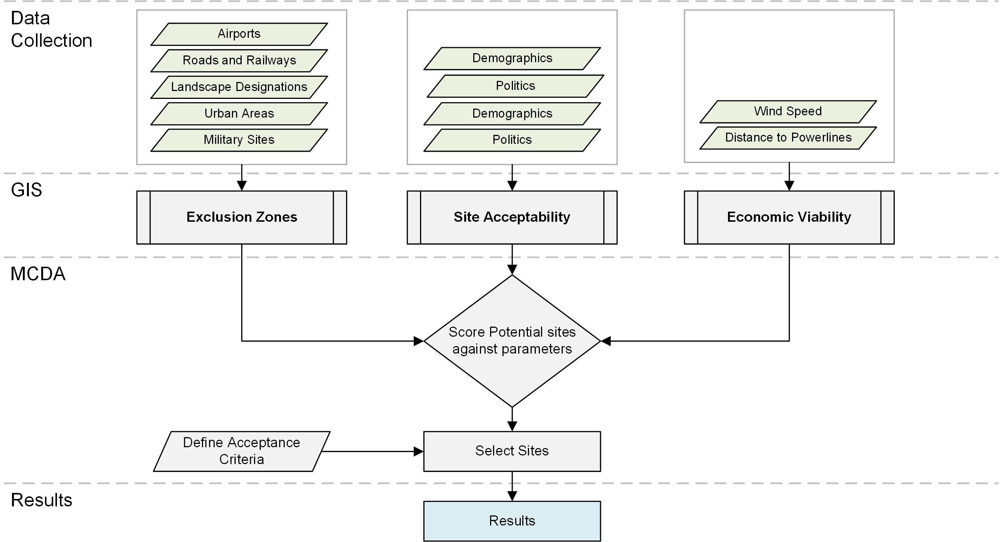
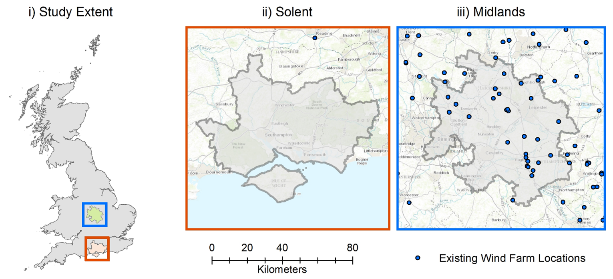
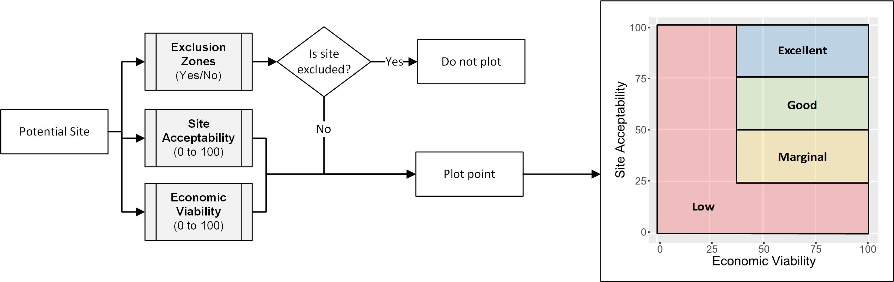
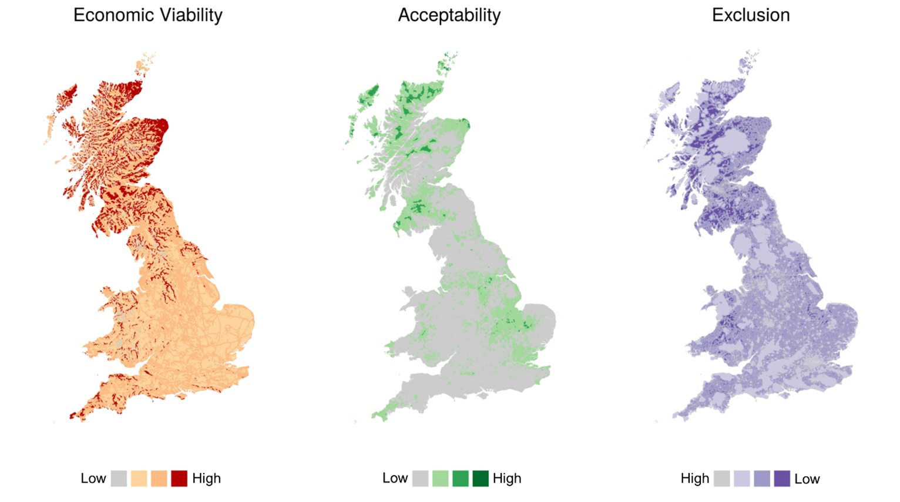
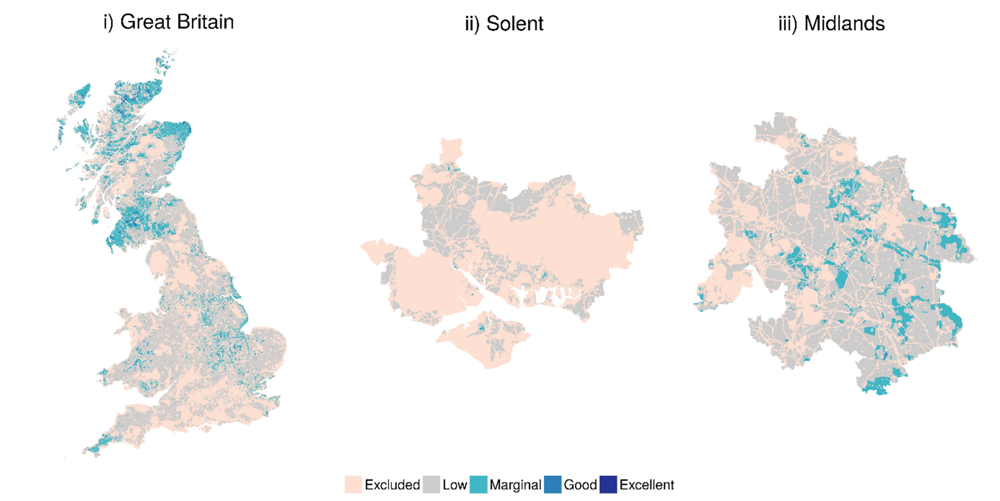
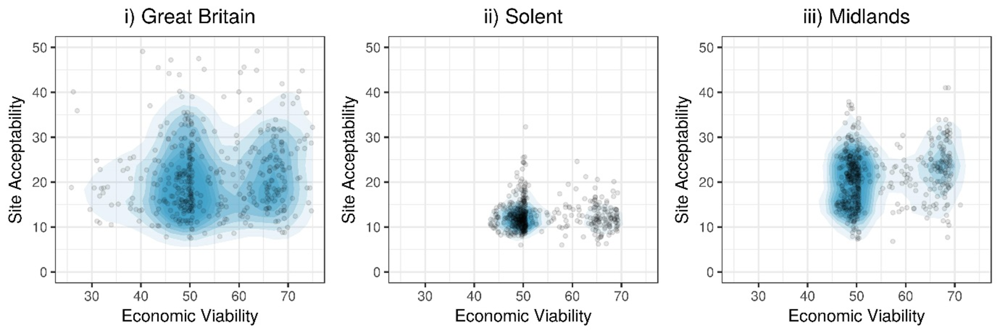

```{r setup, include=FALSE}
knitr::opts_chunk$set(echo = FALSE, out.width = "100%", tidy = TRUE, fig.pos = "!h")
library(bookdown)
library(magrittr)
```

\begin{mdframed}[backgroundcolor=black!5] 
Paper presented in "Proceedings of SET 2017 - The 17th International Confference on Sustainable Energy Technologies, July 17 - July 20 2017, Bologna, Italy"
\end{mdframed}

# Abstract {-}

Onshore wind generation is one of the most cost-effective methods of renewable electricity generation. However, there is often difficulty in identifying suitable sites for development. To assist such systems, geospatial information systems are extensively used in identifying suitable sites for wind turbines: these models predominantly focus on the technical and legislative constraints, and have a limited understanding of the social issues surrounding development. As a result, there are concerns with the validity of these models in accurately determining suitable sites and fail to acknowledge the strong local opposition which some projects can experience. Building upon previous statistical analysis, this paper presents a geospatial multi-criteria decision analysis that integrates the technological, legislative, and social constraints to determine suitable sites for onshore wind turbine development. To the authors' knowledge, this is the first study that aims to understand whether suitable sites are likely to receive planning permission and to integrate this into the decision-making process. The findings highlight the importance of considering the planning constraints within modelling and demonstrates the limitations in identifying suitable sites for development.

# Introduction

Increased environmental concern and issues surrounding security of supply have led to a global drive to develop renewable energy systems. This has led to a large increase in the development of these technologies, which has resulted in significant interest in identifying suitable locations for these to be installed.

While onshore wind power generation is now both a mature technology and competitive with traditional energy supplies in many countries, there are difficulties in identifying suitable sites for wind turbine farms. To assist this development, many geospatial models have been proposed. However, there are concerns that current models provide limited actionable guidance, and in particular fail to account for the challenges faced in projects obtaining planning permission. This can be highlighted in the United Kingdom, where more than 50% of wind turbine projects in the United Kingdom are rejected at planning (DECC, 2016), suggesting that wind turbines are being proposed in areas which are socially unsuitable for development.

The overall objective of the programme of work, to which this paper contributes, is to build a predictive model for locating onshore wind turbine projects, integrating resource availability and the likelihood of a project receiving planning acceptance. In the first stage, statistical analysis was conducted to identify the key influences for planning acceptance of onshore wind turbines. This paper presents the second stage of the analysis, outlining the geospatial model developed for assessing site suitability and decision making for identifying suitable sites for wind turbine development.

The work presented here has four parts: an overview of the literature relevant to onshore wind GIS modelling; a description of the research methodology; presentation of the model results and finally discussion of the theoretical and practical implications of the research and further research opportunities.

# Background

Identifying suitable locations for onshore wind turbines requires the assessment of a range of largely geospatial parameters. As a result,  there has been  extensive use of Geographic Information Systems (GIS) which are designed to capture, store, manipulate, analyse, manage, and present spatial or geographic data [@Malczewski2004]. Such GIS approaches often paired with Multi-Criteria Decision Analysis (MCDA) to provide a method to interpret the geospatial data and rank potential options from the model data.

Early developments in onshore wind GIS-MCDA modelling started in the late 1990s [@Baban2001; @Voivontas1998]. In recent years, there has been significant international interest to model wind turbine site suitability, and a large number of methods have been developed ^[Some of the key studies referenced are [@Atici2015; @Gove2016a; @Janke2010; @Miller2014; @Neufville2013; @Noorollahi2015; @Sliz-Szkliniarz2011; @SQWEnergy2010; @VanHaaren2011; @Wang2014; @Watson2015] ].  These models typically are formed of the stages as shown in Figure 1. Firstly, input parameters are selected covering environmental, technical and social [@Gigovic2017]. For example, ideal sites are typically identified as having high average wind speeds; not being close to urban areas; not in protected landscapes (e.g. National Parks); not close to airports (to minimise radar interference); close to roads for access and finally close to power lines for grid connection. Each location is then scored against these input parameters, and incompatible areas are excluded from further analysis, such as areas which have already been developed (roads and buildings). 

```{r Flowchart, fig.cap="An overview of the typical structure of GIS-MCDA methodologies"}

```

For remaining sites which could be developed, a score is calculated to assess the overall suitability of the site. While several techniques are used, the Weighted Sum Method (WSM) is most typically used as a method to combine the different layers into a single score as follows: 

\begin{equation}
 A_{i}^{WSM} = \sum_{j=1}^{n} w_{j} a_{ij} \quad \text{for} \quad i = 1,2,3,...N
  \label{eq:WSM}
\end{equation}

where $w$ is the parameter weighting, $a$ is the parameter value and $i$ is the attribute layer in the model. This rating can then be used to determine the most suitable sites for development.

A concern surrounding the WSM is that the method is often applied without any insight into the meanings of two critical elements: the weights assigned to attribute layers and the procedures for combining the layers [@Malczewski2004]. While methods such as the Analytic Hierarchy Procedure (AHP) are used to mitigate this (Watson and Hudson, 2015), models remain highly sensitive to the weightings used, and there are concerns that models result provide the sub-optimal location of wind turbine locations, as demonstrated by the high level of projects being refused planning permission within the UK.

To address concerns of parameter weighting, there has been increased interest in quantitatively assessing which parameters influence the likelihood of wind turbines receiving planning permission [@VanRensburg20]. This approach has recently been integrated within GIS modelling to  assess the influence of geospatial parameters in the UK [@Harper2017]. This can be considered as a form of retrospective GIS analysis, where the existing spatial distribution of sites is assessed to enable prediction of where future turbines may be acceptable. Harper et al's results suggest that the 1) *the number of wind turbines*; 2) *percentage of the local population with high levels of qualifications*; 3) *the average age* and 4) *local political composition* emerge as key influences affecting planning approval, while other typically used parameters such as proximity to urban areas appear less influential. However, these finding have yet to be integrated into a GIS-MCDA.

Finally, the issue of the standardisation of non-commensurate criteria within the WSM and GIS-MCDA has yet to be satisfactorily addressed. To create a single site suitability score requires the combination of a range of economic, environmental and social parameters which cannot directly be summed together into a single scale. Methods such as the linear transformation method are often used to standardise each variable, but there is limited empirical justification for such approaches [@Jiang2000]. 

This paper addresses these concerns and presents the results of a GIS-MCDA model that integrates planning acceptance rates into modelling.  This approach builds upon our previous work and demonstrates an alternative layered approach combining non-commensurate parameters, in particular avoiding the use of linear transformations within the MCDA.

# Methodology

The overall structure of the GIS model is shown in Figure \@ref(fig:Methodology), and the stages are described in the following subsections.

```{r Methodology, fig.cap="Overview of the onshore wind GIS-MCDA Structure"}

```

## Model formation

A preliminary scoping study was conducted to formulate the model and identify parameters which influence wind turbine developments. The identification of criteria involves a systematic analysis of factors that may impact installation of the wind farms. This considered a range of academic work as listed in Section 2, consultancy reports [@LandUseConsultants2010; @SQWEnergy2010] and wind turbine planning guidance [@Smith2016].

The study was conducted across Great Britain (England, Scotland & Wales). This was chosen because of the broadly similar categorisation of land types, nature designation, data availability and legislation across these regions. To allow for a more detailed understanding of the local effects, this paper also highlights the results from two case study areas, Solent and the Midlands, as shown in Figure 3. These two areas were selected as there are large differences in the number of wind turbines deployed, with no wind turbines within the Solent region while 30 projects have been constructed within the Midlands region [@DECC2016].

```{r StudyExtent, fig.cap = "Analysis Extent and regions selected for case studies, highlighting the locations of existing wind turbine projects"}

```

Once key parameters were identified, relevant data was collected from a range of sources for geospatial [@Overpass2016; @Survey2016], environmental [@SNH2015] and demographic variables [@OfficeforNationalStatistics]. A full explanation of the datasets is available within the previous work [@Harper2017].

## GIS Model

As highlighted within the background literature, there are challenges in combining non-commensurate data within MCDA. Instead of combining variables into a single score, an approach was developed to group input variables into layers based on their type of influence on a site suitability, with three layer GIS layers being formed; 1) *Site acceptability*; 2) *Exclusion zones* and 3) *Economic viability*. These are explained in more detail as follows.

Site acceptability assess whether the chance of the location receiving planning permission. This layer is based on previous analysis which used logistic regression methods to identify the key influential parameters that determine whether a wind turbine successfully obtained planning consent (Harper et al., 2017). An overall predictive accuracy of 63% was achieved with the model, with the most influential parameters shown in Table \@ref(tab:TableofParameters). The Odds Ratio shown indicates how much the predicted planning acceptance rate changes for each unit of the parameter. For example, for each km a site is further away from an urban region, its likelihood of receiving planning approval increases by 0.176%. 

```{r TableofParameters}
# Table 1 Parameters determined to influence the planning acceptance of wind turbines
knitr::kable(read.csv("tables/TableofParameters.csv", check.names = FALSE, stringsAsFactors = FALSE), 
             booktabs =TRUE,
             caption = "Parameters determined to influence the planning acceptance of wind turbines")
```

Exclusion Zones considers whether the site can be used for development.  Existing legislation and ecological guidance was reviewed, and the geospatial development patterns of existing wind farms were assessed to identify whether specific regions were avoided by developers. These criteria were split into the following taxonomy:

- **Hard Planning Criteria**: these are legislative restrictions that prevent the development in specific areas. For example, wind turbines must not be built within a toppling distance of main roads. 
- **Soft Planning Criteria**: these are derived from statistical analysis of existing wind turbine planning applications to understand regions where turbines were generally not proposed but not legislatively restricted. For example, while it is technically possible to build in National Parks, only two projects have been built within them and therefore these regions can be considered as non-developable areas. This also excludes sites of ecological protection.
- **Buffer Criteria**: explores whether there is any geospatial trend for sites to be located away from certain features. For example, wind turbines sites are not banned near airports, but sites are skewed away from these sites suggesting planners aim to keep distance between the sites.
The values used within each of the exclusion layers are shown Table 2. Based on these three categories, three scenarios were formed to assess the impact of planning restrictions on the development potential: 1) *Low Restriction* (Hard Planning Criteria only) 2) *Medium Restriction* (Hard & Soft Planning Criteria) and 3) *High Restriction* (Hard, Soft and Buffer).

```{r}
# Table 2 Parameters and exclusion distances used within the model

knitr::kable(read.csv("tables/ExclusionZones.csv", check.names = FALSE, stringsAsFactors = FALSE), 
             booktabs =TRUE,
             caption = "Parameters and exclusion distances used within the model",
             format= "latex",
             align = "l") %>%
  kableExtra::add_footnote(c("National Parks, Areas of Outstanding Natural Beauty, Heritage Coast", "National Nature Reserves (NNR), Natura 2000, Special Protection Areas (SPA), Sites of Special Scientific Interest (SSSI)")) %>%
  kableExtra::add_header_above(c(" ", "Exclusion Distance, km" = 3))

```

Finally, economic suitability of the potential financial return of the site. This layer was determined based on the wind speed and proximity of the site to the distribution network. Potential wind power output was calculated using the Weibull probability distribution combined with logarithmic hub height correction. 

Each of the layers were calculated as a raster layer, with a spatial resolution of 250 metres, and were analysed  and integrated using R and supporting geospatial packages *raster* [@raster] and *sp* [@RogerS.BivandEdzerPebesma2013].

## Multi-Criteria Decision Analysis

The model considered the suitability of a site for the installation of single wind turbines, and was based on a 2MW wind turbine which represents the average size of onshore turbines constructed in 2016 [@Vesta2017]. Based on planning guidance, a spacing between turbines of 500m was used [@Smith2016], resulting in a development density of 8MW/km^2^. 

As shown in Figure 4, each site is categorised based on its Economic viability (X-axis) and Site Suitability (Y-axis), with four types of suitability defined (Low/Potential/Good/Excellent). More flexibility is given to the site suitability parameter to reflect that there is less certainty to this value. The analysis selected sites based on their suitability rating. To estimate the potential capacity of sites that could be developed, all sites that score "*Excellent*" or "*Good*" were selected as suitable for development.
 
```{r SiteProcess, fig.cap="Classification of potential sites based on the GIS layer results"}
# Figure 4 

```

# Results

The results from the geospatial model layers are presented in Figure \@ref(fig:GISLayers), which shows the three separate layers of the analysis. These layers are combined to determine the site suitability score displayed under the medium development restriction scenario, as shown Figure 6. Nationally, it can be seen from the results that sites appear to be more suitable within Scotland, the South East of England, and patches of West England. For the Solent region, 77% of the land was excluded with no sites being deemed "Good" or "Excellent" for wind development.  In comparison, 45% of the Midlands region was excluded for development with 1.2GW of potential site capacity identified from suitable sites.

```{r GISLayers,fig.cap="Results for the three onshore wind GIS layers within the model. Darker colours indicate desirable characteristics for wind turbine sites"}

```

```{r ResultsMap, fig.cap="Comparison of Wind Turbine Potential under the medium development scenario"}

```

Table \@ref(tab:ScoreMatrix) provides a detailed breakdown of the land suitability under of the each of the three exclusion regions for the national model. Cells highlighted in grey indicate those which are the most suitable for development potential, being outside crucial exclusion zones and having a high site suitability score. Such sites cover 0.74% of the country, and represents 13GW of potential capacity if fully utilised.

```{r ScoreMatrix}
knitr::kable(read.csv("tables/ScoreMatrix.csv", check.names = FALSE, stringsAsFactors = TRUE, as.is = TRUE), 
             booktabs =TRUE,
             caption = "Site score suitability matrix comparing exclusion criteria against site suitability, coverage of land covered by each classification")

```

The comparative suitability of the regions can also be explored through density plots as shown in Figure \@ref(fig:DensityPlot). Each non-excluded site is represented as a point, and the regional variation in acceptability and economic viability can be viewed on separate scales. The site acceptability within the Solent region is generally less than the national average and the Midlands, although the economic viability is generally similar.

```{r DensityPlot, fig.cap="Two-dimensional Density Plots for wind turbine sites within the the Midlands and Hampshire/Solent regions. Note that the axes have been truncated at a score of 50"}


```

# Discussion

The analysis suggests that 13GW of onshore wind would be highly suitable within a medium development restriction scenario, which considered the "hard" and "soft" planning criteria. If the stricter "buffer" criteria are met, the estimated capacity is reduced to 4 GW. Both these estimates are significantly lower than previous  studies which have suggested total capacity could exceed 200 GW (Stoddart and Turley, 2012; Gove et al., 2016). This highlights the impact of considering likelihood of planning acceptance within the GIS-MCDA and the constraint this places on development.

The case studies of Solent and Midlands highlight the regional variations in onshore wind potential resource as shown in Figures 6 and 7. From a resource perspective, the Solent area is highly suitable with many hilly regions and its coastal location resulting in high wind speeds. However, the opportunity for development is limited by National Parks and Areas of Outstanding Natural Beauty (AONB), and the sites that are located outside of these regions are largely unsuitable for development due to the demographic composition. In comparison, the the Midlands region faces much less restriction in where developments could be made and presents much greater opportunity for future development. 

The results further highlight that cost is not the dominant issue in determining the suitability of a wind turbine site, as wind speeds are largely satisfactory and in UK most sites are an acceptance distance to powerlines for a wind turbine to be economic. A number of previous studies have placed a high weighting on wind resource [@Shirgholami2016], reflecting the interest of the developer to maximise returns. In reality, it may be in their interest to select a less windy site that is more likely to receive planning permission.

On a national level, it is important to consider the distribution of potential sites and the consequent impact this may have on the electricity transmission network. The results indicate that regions in Scotland and the South West are most suitable for further development; however, such areas are distant to large load centres such as cities, requiring transmission networks or energy storage to be upgraded.

A benefit of building the model into several intermediate layers, such as used in this model, is that it allows the results to be more easily interpreted and minimise the concerns surrounding standardisation of parameters. When combining the variables into a single suitability score, it can easily hide or distort what is influencing the site score, and make it difficult to understand why some sites are more suitable than others are. 

# Limitations & Future Work

Such models are highly influenced by the availability and quality of the data¬ for the analysis. Wind speed is only available at 1km resolution and does not account for roughness of surface caused by urban developments of varying land cover such as forests [@DTI2001]. The errors from any dataset will have propagated through the analysis and, combined with errors from other layers, may cause inaccuracies in the output map. Future work will therefore investigate the sensitivity of results.

Whilst the analysis has tried to understand the chance of a project being accepted, it has only considered geospatial parameters. As previous studies have highlighted, such parameters in themselves only provide part of the explanation as to why wind farms are accepted  [@Langer2016a; @Toke2005]. Greater emphasis must also be placed on the planning process and local engagement of a wind project if it is to be successful at planning.

The analysis has also not considered the impact of electricity transmission networks, and the potential requirement of grid reinforcements. It is already being seen in the UK that grid reinforcements are being made to transfer electricity and this is becoming a limiting factor in the development of renewable energy projects [@NationalGrid2015]. The majority of sites identified as suitable for development are distant from large load centres, and therefore would place additional strain on the transmission network to transfer this electricity across the country. It is therefore important that this issue is explored further in future analysis.

The model only considers the suitability of individual wind turbines, and does not assess whether an area is suitable for development of a larger wind farm. There would be economies of scale in proposing a single larger development, and as such, these locations would be preferential to developers. 

The analysis did not consider the influence of the cumulative number of wind turbines within a certain area. It is not fully understood within literature whether there is a limit to the development potential of wind turbines, although some evidence suggests that regions can reach a saturation level [@Toke2008].

# Conclusion

The authors' have presented a GIS-MCDA which can be used to assist in location onshore wind turbines. By integrating planning acceptance rates into the decision-making process, the results of this model have highlighted that the potential resource is significantly lower than previous estimates. However, there remains an opportunity for further development of onshore wind turbines to help meet renewable electricity generation targets.

The GIS-MCDA presented an alternative method of combining non-commensurate data into the decision-making process. By avoiding the use of standardisation, there is less distortion to the input data and this reduces potential errors within the model results. This also provides greater insight into the model results as it is easier to understand the factors influencing site suitability.  

Using two case studies, the results have shown how the onshore wind capacity can vary significantly for similar types of regions within the same country. This can be influenced by physical restrictions such as landscape and nature designations, or "hidden" factors such as local demographics and political composition. It is therefore important that these factors are understood when wind turbines are being considered within a region.

The findings of this study can be used by a range of stakeholder to improve the planning and development of wind turbines.  As examples, regional planners could more accurately estimate the potential capacity within their region, and project developers could gain a greater understanding of where sites should be proposed to increase the likelihood of receiving planning permission. The results should support, not replace, local level planning.

Whilst the analysis was completed within Great Britain, the concepts developed can be applied internationally. However, the specific planning acceptability data will have to be the region as outlined in previous analysis [@Harper2017]. 

# Acknowledgements {-}

This work is part of the activities of the Energy and Climate Change Division and the Sustainable Energy Research Group at the University of Southampton [www.energy.soton.ac.uk](www.energy.soton.ac.uk). It is also had financial support from EPSRC grants: EP/J017698/1, Transforming the Engineering of Cities to Deliver Societal and Planetary Wellbeing, EP/N010779/1, City-Wide Analysis to Propel Cities towards Resource Efficiency and Better Wellbeing and EP/K012347/1, International Centre for Infrastructure Futures (ICIF). 

# References
