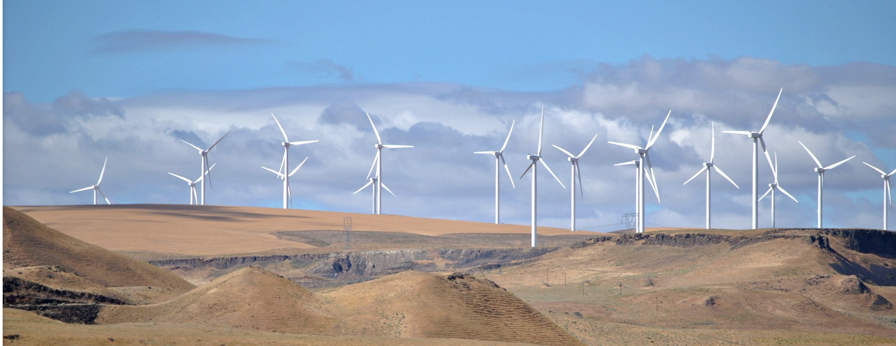
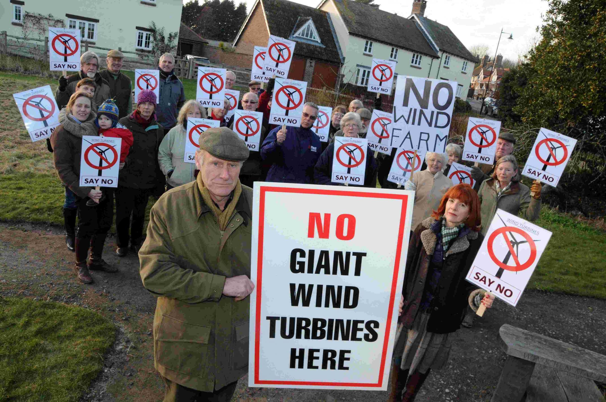
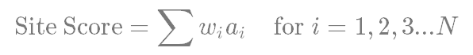
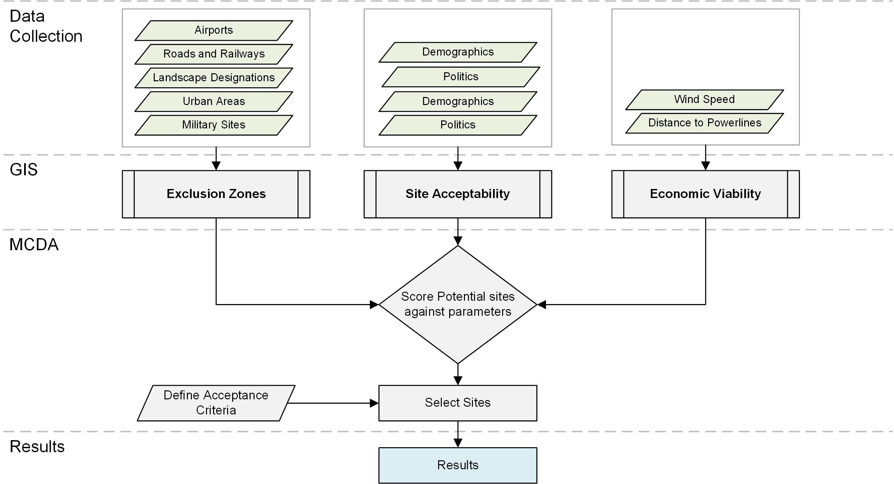
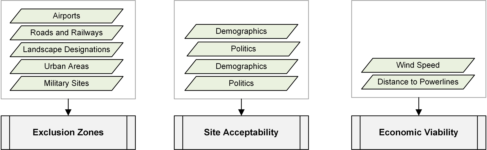
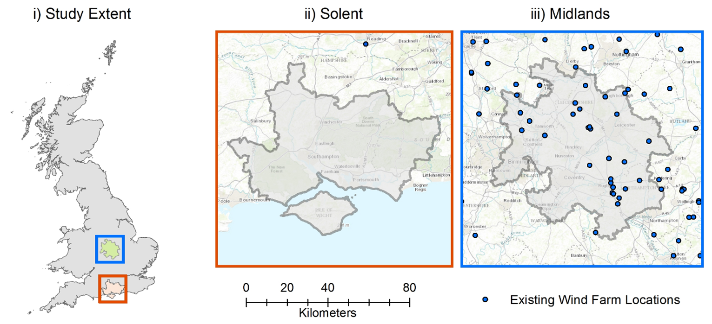
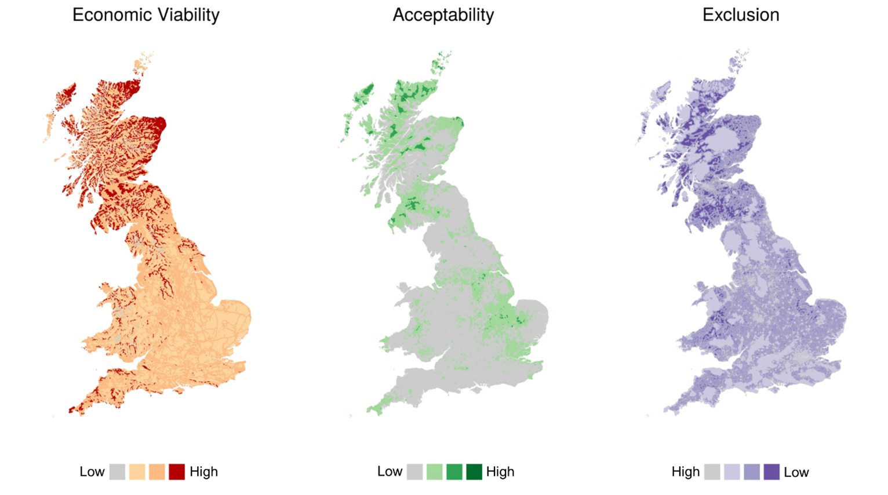
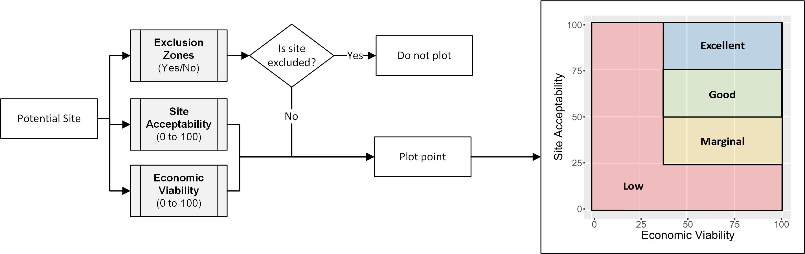
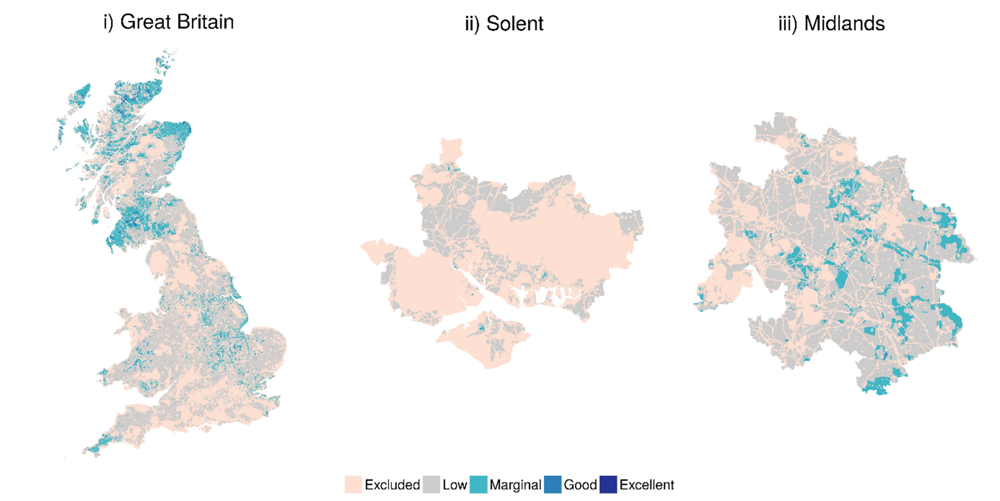
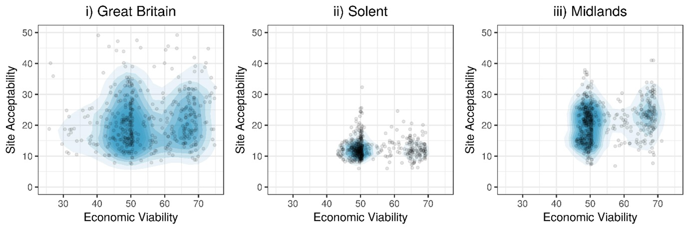

```{r setup, include=FALSE}
knitr::opts_chunk$set(echo = FALSE, out.width = "70%", fig.align = "center", message = FALSE, warning = FALSE)

# Load Relevant Packages
library(plotly) # Interactive graphs
library(knitr)
library(magrittr)
library(kableExtra)
library(DiagrammeR)
library(ggmap)
library(mapdata)
library(ggplot2)
```

## Introduction

- Large resource availability
- Cost effective decarbonisation technology

```{r}

```


## Challenges

- Visually intrusive
- Highly site dependent
- Wide range of environmental, social and economic parameters
- Planning approval

```{r, out.width="40%"}

```

## Background

- Extensive use of Geospatial Information Systems (GIS) to identify suitable sites
- Multi-criteria decision analysis (MCDA) used extensively to determine best options
- Use economic, environmental and social parameters

```{r, fig.asp=0.2, fig.align = "center", out.width="100%"}

grViz('
      
digraph G {
graph[font = fontcm]
rankdir=LR

node [fontname = "helvetica", shape=box, style = filled, height = 0.8, fillcolor=WhiteSmoke, fontcolor = black, width = 1.5];
Input[label = "Select input \n parameters"]
Score[label = "Score each site \n against \n parameters"]
Weighting[label = "Assign \n weightings to \n each parameter"]
Suitability[label = "Calculate site \n suitability"]
Select[label = "Select suitable \n sites"]

Input -> Score -> Weighting -> Suitability -> Select

}

      
      ')
```

## Calculating Site Score

Weighted Sum Method frequently used to determine site suitability

```{r, out.width="45%"}

```

- How to determine parameter weighing?
- How to combine non-commensurate data?

```{r}

```

# Research

## Research Approach

1) Create a geospatial information system to locate wind turbines
2) Avoiding combination of non-commensurate data where possible

## Research Approach

```{r, out.width="85%%"}

```

## Model Layers

```{r}

```

## Study Locations

```{r, out.width="85%"}

```

## GIS Layers

```{r, out.width="85%"}

```

## Calculating Site Score

```{r, out.width="100%"}

```

## Model Results

```{r, out.width="100%"}

```

## Model Results

```{r, out.width="100%"}

```

## Discussion

- Study suggests 13GW of potential within the UK (5% of previous estimate)
- Highly regional capacity restraints
- Cost not dominant issue
- Legislative issues

## Future Work

- Sensitivity Analysis
- Improve Access to Results for planners
- Spatial Scale

## Thank You

```{r, out.width="45%"}

```
<hr>
<p style="font-size:15px">
**Michael Harper** <br>
[Sustainable Energy Research Group](www.energy.soton.ac.uk), University of Southampton <br>
**Email**: m.harper@soton.ac.uk <br>
**Twitter**: @MikeyLHarper <br>
</p>

