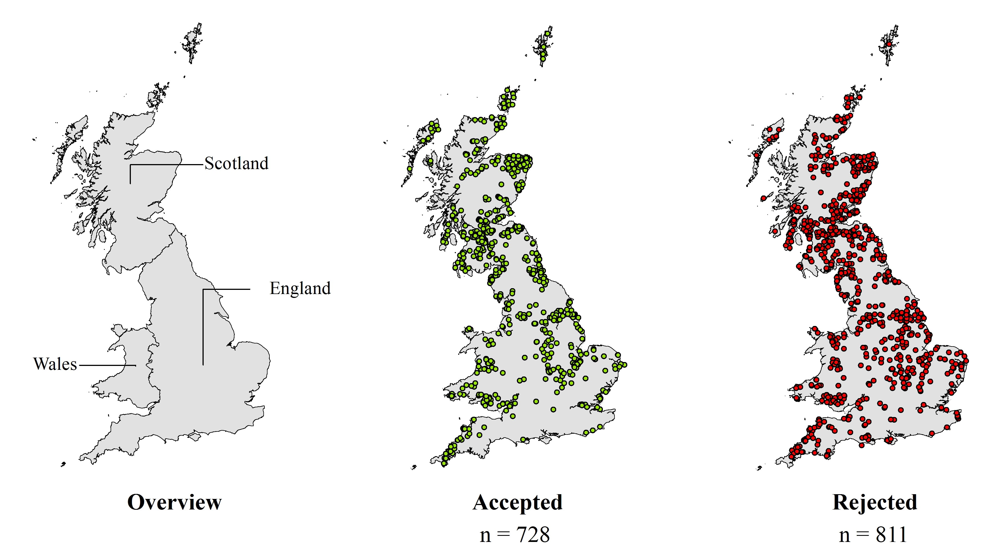
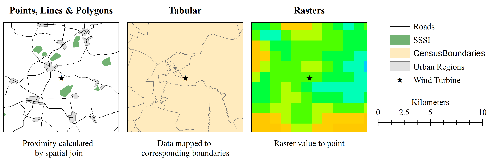
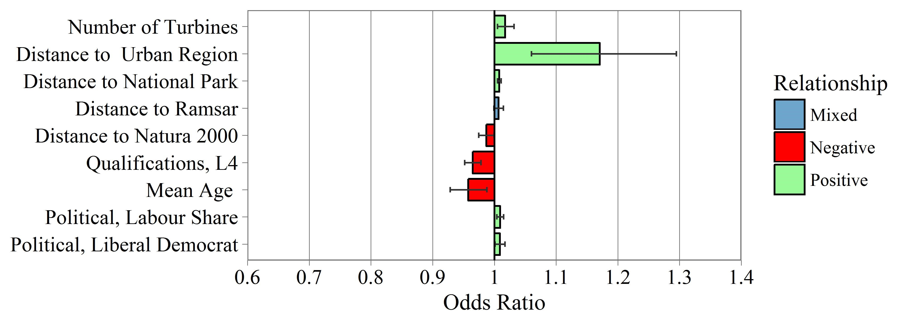

```{r setup, include=FALSE}
knitr::opts_chunk$set(echo = FALSE, out.width = "100%", tidy = TRUE)
library(bookdown)
```

\begin{mdframed}[backgroundcolor=black!5] 
Paper presented in "Proceedings of ECOS 2017 - The 30th International Confference on Efficiency, Cost, Optimization, Simulation and Environmental Impact of Energy Systems, July 2 - July 6 2017, San Diego, California, USA"

This version presents the final draft and is available through EPrints: https://eprints.soton.ac.uk/408181/
\end{mdframed}

## Abstract {-}

There is a global drive to develop renewable energy power generation to reduce environmental impacts and enhance energy security especially through indigenous resources. Wind energy conversion both on and offshore is one of the most effective technologies to provide sustainable power. In the deployments of such technologies, geographical information systems are extensively used to identify suitable sites for the installation of wind turbines. However, there are concerns that such approaches fail to model site suitability accurately, and in particular fail to account for the difficulties faced in gaining planning permission. This study has explored whether the planning success of proposed wind turbine projects can be predicted using a range of geospatial parameters based on Great Britain as a case study. Logistic regression is used to assess the relationship between appropriate variables and planning outcome. The results indicate that the size of the project, percentage of the local population with high levels of qualifications, the average age, and local political composition emerge as key influences affecting planning approval. To the authors' knowledge, this is the first study which has quantitatively linked regional social and political data to the planning outcome of wind turbines. These findings can help reduce the level of planning issues encountered for proposed wind turbine, improving the accuracy of GIS modelling of wind turbines.

## Keywords {-}
Onshore Wind, Logistic Regression, Planning, Demographics, Great Britain, GIS

#	Introduction

Increased environmental concern and issues surrounding security of supply have led to a global drive to develop renewable energy systems. In the European Union, over $40 billion is invested annually in renewable energy technologies (mostly wind and solar) and it is expected to increase by a further 50% by 2020 [@UNEP2016]. 

Onshore wind power generation is now competitive with fossil energy in many countries and is one of the most mature renewable energy technologies available.  However, there are major technical challenges in identifying suitable sites for wind turbine farms. Projects often face strong local opposition, as can be seen from the low acceptance rates of wind turbines in Great Britain, with over 50% of onshore projects rejected [@DECC2016].

A large number of geospatial models have been produced to determine site suitability for wind farms [@Atici2015, @Aydin2010, @Baban2001, @Gass2013, @VanHaaren2011, @Hansen2005, @Janke2010, @Lee2009, @Miller2014, @Neufville2013, @Noorollahi2015, @Sliz-Szkliniarz2011, @SQWEnergy2010, @Voivontas1998, @Wang2014, @Watson2015, @Yue2006], but such models are highly sensitive to the underlying modelling assumptions, and there has been limited validation of these models against actual developments patterns. A few studies have aimed to rigorously quantify key influences on historical planning outcomes [@Haggett2006, @VanderHorst2010, @VanRensburg20, @Toke2008], but such analysis has yet to be integrated within a full geospatial model.

The overall objective of the programme of work to which this paper contributes is to build an overarching model integrating resource availability and likely acceptability of onshore wind turbine projects. This paper presents the first stage of this analysis, assessing which parameters influence wind turbine planning outcomes utilising a range of physical, geographical, demographic and political parameters. In doing so, it responds to calls to merge qualitative and quantitative analysis of wind projects to gain a greater understanding of project approval [@Langer2016a]. 

The work presented here has four parts: a review of existing literature relevant to onshore wind modelling; collection and processing of appropriate data sources used within the analysis; research methodology and results and finally discussion of the theoretical and practical implications of the research and further research opportunities.

# Background

Geographic Information Systems (GIS) are tools designed to capture, store, manipulate, analyse, manage, and present spatial or geographic data [@Malczewski2004]. They are used extensively to assist in locating wind farms, and combine a range of geospatial information into the decision-making of wind energy development [@Resch2014]. Early work by Voivontas et al. [@Voivontas1998] and Baban and Parry [@Baban2001] provide examples of such analysis, and established the structure for an international range of studies which have largely followed the approach outlined in Figure \@ref(fig:StagesofAnalysis)

```{r StagesofAnalysis, fig.cap="Typical stages of geospatial models for assessing wind turbine site suitability"}


```

Similar parameters are used throughout the studies, and ideal sites are typically identified as having high average wind speeds; not being close to urban areas; not in protected landscapes (e.g. National Parks); not close to airports (to minimise radar interference); close to roads for access and finally close to power lines for grid connection. However the weights for each parameter in subsequent predictive models have traditionally been determined using surveys and questionnaires [@Baban2001, @Aydin2010, @Neufville2013, @Atici2015] or previous literature [@Gass2013, @Wang2014, @Watson2015]. To the authors' knowledge, there have been no attempts to statistically validate the relative importance of parameters used and it is therefore unclear whether the parameters currently used are actually appropriate for site approval rates. In a significant contribution, this paper derives these weights using a statistically rigorous methodology and then tests their ability to correctly predict planning outcomes. 

In addition, there is increased awareness of the wider social challenges surrounding the development since geographical variables in themselves are insufficient to explain patterns of implementation of wind power [@Toke2008, @Devine-Wright2005a]. Recent studies have explored how planning decisions were influenced by key actors (e.g. local communities, planning authorities, project developers) [@Toke2008, @Haggett2006] and local characteristics [@VanderHorst2010]. In particular, a study by Van Rensburg et al. [@VanRensburg20] explored wind farms project planning approval against a range of technological and institutional process variables. The results suggested a number of variables appeared significant for planning including the proximity to Natura 2000 sites (an EU protected habitat designation); sites with high bird sensitivity; hub height and project installed capacity.  In addition, the study noted that proximity of the nearest dwellings and wind speeds appeared insignificant, a finding which counters the views reported within many previous studies. Other work has investigated the social factors that may influence planning decisions [@Langer2016a, @Alvarez-Farizo2002, @Groothuis2008, @Krueger2011, @Jones2010a]. For example, studies within Great Britain suggest that support for wind developments decreases as both income and age increase [31], and  people with higher levels of qualifications are less likely to support projects [@Krueger2011]. However, whilst these potential social factors have been identified, there have been no attempts to include these parameters within geospatial analysis of potential turbine developments. This work therefore integrates the demographic and political parameters into geospatial analysis with the aim of improving the validity of such a model.

In consequence this paper builds upon many of the concepts developed by Van Rensburg et al., but aims to apply these concepts to a broader range of geospatial, demographic and political datasets.

#	Data and Variables

An extensive literature review was conducted to identify geospatial and social parameters which have been connected to the planning outcomes of wind turbine applications. Parameters were collated from existing geospatial models, and reviewing qualitative and quantitative studies. The key sources included Baban and Parry [@Baban2001], Langer et al. [@Langer2016a] and European Wind Energy Association [@EuropeanWindEnergyAssociation2012]. 

##	Study Region

The study was conducted across Great Britain (England, Scotland & Wales). This was chosen because of the broadly similar categorisation of land types, nature designation, data availability and legislation across these regions. 

##	Data Sources

Information for turbine planning applications was collected through the Renewable Energy Planning Database (REPD) [@DECC2016] with planning dates between January 1991 and December 2016 (n=1755). Detailed information for each planning application includes the location; year of application; number of turbines; turbine capacity and planning decision. 

The planning permission status was summarised to two variables: accepted and rejected.  Figure \@ref(fig:StudyExtent) highlights the location of the sites the distribution of these points and the planning status.

```{r StudyExtent, fig.cap="Location of onshore wind turbine planning applications used within the study. Location data extracted from the Renewable Energy Planning Database"}

```

Wind speeds were taken from the Numerical Objective Analysis of Boundary Layer (NOABL) wind speed database, which provides estimated annualised wind speed at 45m elevation  at a resolution of 1km grid [@DTI2001].  This source is used extensively by wind assessment studies conducted within the UK [4, 10, 17].
Physical features including roads, railways and urban areas were collected from OS Strategi [@Survey2016]. The electricity transmission network and Airport location data (civil and military) were extracted from Open Street Maps (OSM) [@Overpass2016].

Site elevation and slope is used by a number of studies to determine site suitability [@Baban2001, @Janke2010]. Elevation was extracted from a Digital Elevation Model (DEM) of Europe at a 25m resolution [@EEA2013]. This data was then used to calculate the slope using the slope calculation tool within ArcGIS 10.2.

Census data was collected at the Lower Super Output Area (LSOA) and Data Zone (Scotland) which represents regions with a population between 1000 and 3000 people. Data was collected for mean age; social grade (percentage of higher social class AB, representing higher & intermediate managerial, administrative, professional occupations); tenure (ownership of homes) and levels of qualifications (percentage of population with university degree).

Planning decisions for turbines are influenced by the Local Planning Authority, which are the local political bodies within the UK [@HMGovernment2014]. In total, there are 405 local authorities across England, Scotland and Wales. Data was collected for the Conservatives; Labour, Liberal Democrat and the Scottish National Party (SNP), which between them hold 95% of seats within Great Britain.

##	Data Transformations

The data sources came in a range of formats including points, lines and polygons (roads, urban regions etc.), tabular (census and political data) and rasters (wind speed, elevation, slope) as highlighted in Figure \@ref(fig:MappingParameters).  These parameters had to be summarised for each wind turbine farms within the model. ArcGIS 10.3 was used to aggregate the datasets as follows:

-	**Points, lines and polygons**: A spatial join was completed to find the distance to the nearest feature for each turbine. A value of 0 is given if the turbine is within the feature.
-	**Tabular**: corresponding political and census boundaries were used to map the tabular data, and turbines assigned the value of the region. In addition, political data was filtered to the year of the planning application to determine the political balance at the time of planning.
-	**Raster**: The tool "Raster Value to Point" was used to extract the values for each site.
The complete list of parameters used within the analysis is shown in Appendix A.

```{r MappingParameters, fig.cap="Mapping of Parameter data to turbine locations"}

```

#	Methodology

A logistic regression analysis was conducted to model the factors associated with a positive planning outcome of wind turbine applications using the predictor variables listed in Table \@ref(tab:ModelsSummary). A hierarchical approach was applied to the model building by adding variables sequentially based on the following order of priority: Physical attributes of the site; Distance to Features; Environmental and Natural Designations; Social (Census) Data and finally Political Data. This order was selected to reflect the current approach of geospatial studies, which as mentioned above, generally do not consider the last two.

For each additional set of parameters added to the model, diagnostic checks were made to ensure that the assumptions of logistic regression were maintained. Each parameter was checked for linearity of the logit for independent variables, absence of multicollinearity and independence of variables [@Harrell2001]. Any parameters which violated these conditions were removed from the model.  The overall fit of the model was assessed using Pearson chi-squared, Psuedo R2 values and the residual deviance. Internal validation was used to assess the predictive accuracy of the model [@Hosmer2004].

Once all parameters had been included within the model, a parsimonious model (one that accomplishes a desired level of explanation or prediction with as few predictor variables as possible) was produced to remove uninfluential parameters [44]. The Akaike Information Criterion (AIC) was used to determine the best fitting subset of parameters. This method avoids the issues associated with step-wise approaches of parameter removal [@Harrell2001] and resulted in nine effective parameters.

In addition, regional differences in parameters effects between England, Scotland and Wales were hypothesised due to differing population densities (England: 413/km^2^, Wales: 149/km^2^, Scotland: 68/km^2^) [@ONS2013] as well as differing institutional support, with Scotland in particular placing a greater emphasis on the development of onshore wind [46]. To test this, separate logistic regression models were produced for each country.  These re-used the subset of influential nine  parameters (see Figure \@ref(fig:OddsPlotSegmented)) with the additional inclusion of Wind Speed, which had been suggested to be influential in previous research [@VanRensburg20].

#	Results 

Table \@ref(tab:LogisticResults) provides the results from the parsimonious logistic regression analysis associating planning approval for all available cases. Statistically significant positive trends (e.g. increase in the parameter increases success rates) were observed for Number of Turbine; Distance to Urban Regions; Distance to National Parks; Percentage of local council Liberal Democrat and Percentage of local council Labour. Negative associations were found for Qualifications above L4 (university degree); Mean Age and Distance to Natura 2000 sites. The odds ratios (OR) are shown for each parameter in Figure 4, whereby an OR = 1 means the parameter does not affect odds of the planning outcome, OR > 1 indicate the parameters positively influence planning acceptance, OR < 1 represents a negative parameter influence.

As noted, the reduced parameter set of parameters were also used to assess models for England, Scotland and Wales separately and the odds ratios for each parameter for these models are shown in Figure \@ref(OddsPlotSegmented).  

Finally, a summary of the different logistic models is shown in Table \@ref(tab:ModelsSummary).

```{r LogisticResults}

knitr::kable(read.csv("figures/LogisticRegressionResults.csv", check.names = FALSE),
             booktabs =TRUE,
             caption = "Logistic Regression results for the AIC optimised model.")

```

```{r ModelsSummary}

knitr::kable(read.csv("figures/OddsTable.csv", check.names = FALSE),
             booktabs =TRUE,
             caption = "A summary of the logistic regression models")

```

```{r OddsPlotReduced, fig.cap= "Odds plot for the reduced logistic regression mode. Error bars show the 95 confidence interval."}

```

```{r OddsPlotSegmented, fig.cap= "Odds plot for the nested logistic regression models for England, Scotland and Wales. Error bars indicate 95 confidence intervals."}
knitr::include_graphics("figures/OddsPlotSegmented.jpg")
```

#	Discussion
The "all countries" model highlighted several key parameters, as shown in Figure \@ref(OddsPlotReduced). First, for project characteristics, the number of turbines appears significant in determining project success although the magnitude of the effect is relatively small. It is suggested that developers are more likely to appeal the decisions made against larger wind farms, as rejection of such projects would result in a large loss of revenue. 

A number of physical parameters have been identified as significant. The distance to urban areas has been highlighted as an indicator, although with considerable uncertainty as the confidence intervals indicate. There are a number of potential causes for this: firstly, it could indicate that high wind speed sites suitable for development tend to be naturally less populated (i.e. hilly, isolated regions). Additionally, it may reflect a so-called "Not in My Back Yard" (NIMBY) view from local population, with project in closer proximity to urban areas being more likely to be rejected. However, there are conflicting views in literature whether NIMBY views impact wind turbines, with a range  of  positive [@Haggett2006, @Jones2010a] and negative [@VanRensburg20, @Devine-Wright2005a, @Populus2005] studies.

For Landscape and environmental designations, distance to National Parks and Natura 2000 sites were indicated as significant, although have marginal impacts. It had been expected that such parameters would be more influential, as the visual impact of wind turbine land is often stated as a reason for project refusal [@Jones2010a]. 

Both the level of qualifications, and the mean age of the local populous have been retained as significant parameters for Demographic variables. It is suggested that regions of higher education may be more effective in organising campaign groups against such projects. This supports the hypothesis developed by Van der Horst and Toke [@VanderHorst2010] that developers were "keen to avoid relatively privileged communities and target areas where people are thought to less likely put up a fight".

For political variables, the percentage of local council authority control for Liberal Democrats and Labour both appear significant. It is suggested that this may be because these parties are broadly supportive of wind projects at a national level, and as such, local planning decisions may be more favourable for proposed projects. In addition, other studies have highlighted that voters of these parties are personally more in favour of onshore wind [@Populus2005], which may result in less local objection against projects in areas where they have stronger support.

There are notable parameters which do not prove influential, including wind speed and the proximity to airports.  This may reflect that these parameters represent technical challenges which can be investigated in the early stages of project development, and therefore any sites that are not suitable will not seek planning permission.

Figure 5 highlights that, as hypothesised, the odds ratios for parameters vary by country, although the reduced number of cases in each model increases the uncertainty substantially as indicated by the confidence intervals. It can be seen that parameters such as Turbine Capacity; Wind Speed and Distance to Urban Regions show differing relationships for each country. These suggest that there may be differing motives for projects within each country as well as differential planning constraints. For example, projects within England appear to place higher emphasis on wind speed. It should be noted that the wind resource is more marginal in England, and it is suggested that low wind speed may be an easy way for projects to be rejected.

For the Scotland model, the percentage of local council authority control for SNP appears significant, with increased percentage resulting in a lower acceptance rate.  However, upon further inspection, this was deemed to be a potential confounding variable with the year of application: SNP have increased their share of council seats between 1990 and 2016 from 15% to 35%, while at the same time the average acceptance rates have reduced from around 75% to 40% across that period. This parameter therefore appears to capture a national trend, rather than highlighting any local political influences. 

As shown in Table 3, there is a relatively low level of fit with Psuedo R2 values of 0.1. Splitting the model into England, Scotland and Wales marginally improved these values to 0.11, 0.16 and 0.24, suggesting the model was a better fit for Scotland and Wales. However, while the accuracy of the Scotland model improved against the "all countries" model (60% to 65%), the Wales only model has decreased to 57%, suggesting that this model has been overfitted due to the reduced number of observations (n = 132).

#	Conclusions & Implications

This paper has investigated the influence of geospatial, environmental, demographic and political attributes on the probability of wind farm planning approval in Great Britain between 1990 and 2016. The study findings reveal that local demographic and political parameters appear to influence the planning outcomes of projects, and that many of the geospatial parameters typically integrated into wind turbine models appear insignificant in determining site approval. To the authors' knowledge, such quantitative findings have not previously been demonstrated using such datasets.

It appears that certain demographics are less accepting of onshore wind in Great Britain. Given that UK planning policy has now devolved power locally and allowing local communities to have the final say on projects [48], there may be a clear block to development in certain regions in the country.

In addition, the results raise concerns of the predictive ability of existing geospatial modelling in locating wind turbine sites.  These findings provide evidence to support existing literature that GIS tools in themselves are of limited applicability [@Toke2005, @Malczewski2004], and supports the conclusion that greater emphasis needs to be given to the non-physical elements of a project (e.g. Community engagement with the scheme from an early stage) [@Toke2008, @Wolsink2000, @Warren2010].  

Because of the low model fit, future work aims to integrate more detailed information about specific wind turbine sites. It has not been possible to include detailed information of the project development within the analysis. Studies have highlighted that the interaction of developers with local communities are key indicators of positive planning approval outcomes [@Toke2005, @Devine-Wright2005a, @Wustenhagen2007]. 

It should be noted that the parameters used to derive these findings are obtained with context to Great Britain, and therefore may have limited applicability internationally, and therefore should be applied with caution outside of this region. There are opportunities to expand upon this work by exploring the international context of the finding to widen its applicability.

## Acknowledgments {-}

This work is part of the activities of the Energy and Climate Change Division and the Sustainable Energy Research Group at the University of Southampton [www.energy.soton.ac.uk](www.energy.soton.ac.uk). It is also supported by ESPRC under grant EP/J017698/1, Transforming the Engineering of Cities to Deliver Societal and Planetary Wellbeing and the Faculty of Engineering and Environment at the University of Southampton. 

## Supplementary Files {-}

The supporting data and analysis is available on Southampton Eprints [(https://eprints.soton.ac.uk/408181/)](https://eprints.soton.ac.uk/408181/) and through GitHub [(https://github.com/mikey-harper/WindStatisticalAnalysis)](https://github.com/mikey-harper/WindStatisticalAnalysis)

```{r, message=FALSE, warning=FALSE}
library(magrittr)
knitr::kable(read.csv("figures/ParameterTable.csv", check.names = FALSE),
             booktabs=TRUE,
             caption = "Summary of data sources used within model",
             format = "latex") %>%
  kableExtra::add_footnote("* Roads are broken into four main categories: Motorways, A Roads, B Roads and Minor Roads. ** High Voltage network at 140-400kV. *** L4 represents degree level or above. **** AB represents Higher & intermediate managerial, administrative, professional occupation") %>%
  kableExtra::landscape() %>%
  kableExtra::kable_styling(latex_options = "scale_down")

```

# References {-}
