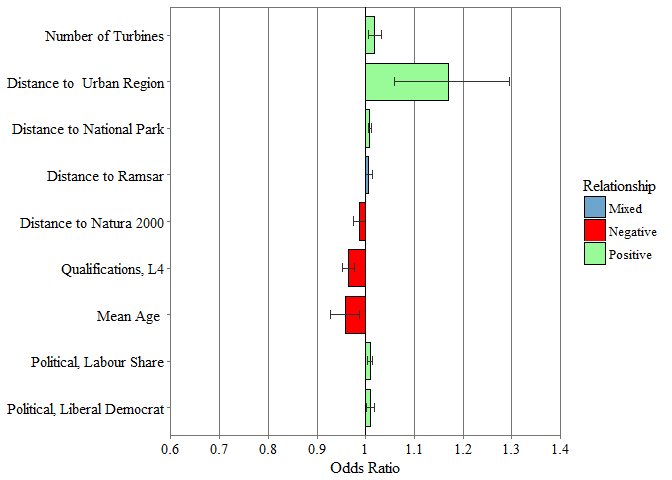

Creating Parsimonious Model
================
Michael Harper
2017-02-09

So far, the model has only removed variables if they were deemed to be erroneous: primarily this was checked through the diagnostic checks which looked for collinear variables and autocorrelation. However the significance of the parameters has so far been ignored.

The aim of this section is remove parameters from the fifth model while minimizing the reduction in the Pseudo *R*<sup>2</sup> values. In doing so, it aims to produce a simplified model which contains only the most important parameters while maintaining the level of predictive ability of the model.

The following parameters were remaining in the model after the hierarchical analysis filtered datasets which violated the logistic assumptions:

``` r
# Extract parameters into a dataframe
VariableList <- c("No..of.Turbines", "Turbine.Capacity..MW.", 
    "Windspeed45", "Ukelevation", "Powerlines", "Airports", "Aroads", 
    "Broads", "Minroads", "Motorways", "Railway", "Urbanregions", 
    "Aonb", "Nationalparks", "Hcoast", "Nnr", "Ramsar", "Sacs", 
    "Spa", "Sssi", "Qual_PercentL4", "Age_Mean", "PercentOwner", 
    "SocialGradePercentAB", "Con_share", "Lab_share", "LD_share")
```

Model Reduction
---------------

The building of the model was based on the logical classification of parameters based on their inferred importance in decision making. In order to optimise the model, it seemed appropriate that a step-wise model was used to remove the least significant parameters.

``` r
WindModel <- LogisticModel(VariableList, TurbineData)

# List Least Importance parameters
importance <- round(caret::varImp(WindModel), 3)
(importanceordered <- importance[order(importance$Overall), 1, 
    drop = FALSE])
```

    ##                       Overall
    ## Hcoast                  0.024
    ## Sacs                    0.124
    ## Turbine.Capacity..MW.   0.183
    ## Railway                 0.293
    ## Broads                  0.368
    ## Aroads                  0.385
    ## Nnr                     0.413
    ## Con_share               0.463
    ## Windspeed45             0.513
    ## Motorways               0.600
    ## Sssi                    0.663
    ## PercentOwner            0.754
    ## SocialGradePercentAB    0.793
    ## Aonb                    1.073
    ## Powerlines              1.239
    ## Ukelevation             1.493
    ## Airports                1.497
    ## Urbanregions            1.785
    ## Ramsar                  1.942
    ## Spa                     2.000
    ## Nationalparks           2.092
    ## LD_share                2.144
    ## Minroads                2.161
    ## No..of.Turbines         2.666
    ## Qual_PercentL4          2.667
    ## Lab_share               2.838
    ## Age_Mean                2.840

``` r
# Number of parameters to exclude from best GLM
Remove <- 13
```

The worst performing variables will be prefiltered from the optimisation to improve computation time. For *n* parameters removed, there will be a computational speed increases of 2<sup>*n*</sup>. The parameters removed are: Hcoast, Sacs, Turbine.Capacity..MW., Railway, Broads, Aroads, Nnr, Con\_share, Windspeed45, Motorways, Sssi, PercentOwner, SocialGradePercentAB

Finding the Best Fitting Model
------------------------------

The "bestglm" package is used to find the best fitting subset of parameters.

``` r
# Filter variable list by removing lowest x parameters
VariableList <- ParameterUpdate(VariableList, remove = c(row.names(importanceordered)[1:Remove]))

# Full data must be formatted in suitable way for analysis
colref <- match(VariableList, names(TurbineData))
datasubset <- TurbineData[, c(colref, 66)]

# Identify best fit
BestglmResults <- bestglm::bestglm(datasubset, IC = "AIC", family = binomial)
```

    ## Morgan-Tatar search since family is non-gaussian.

``` r
# Save the results for the best model
BestModel <- BestglmResults$BestModel

# Show summary statistics
summary(BestModel)
```

    ## 
    ## Call:
    ## glm(formula = y ~ ., family = family, data = Xi, weights = weights)
    ## 
    ## Deviance Residuals: 
    ##     Min       1Q   Median       3Q      Max  
    ## -2.6202  -1.0763  -0.7497   1.1275   1.7742  
    ## 
    ## Coefficients:
    ##                  Estimate Std. Error z value Pr(>|z|)    
    ## (Intercept)      1.674739   0.755142   2.218  0.02657 *  
    ## No..of.Turbines  0.017429   0.006758   2.579  0.00991 ** 
    ## Urbanregions     0.157760   0.051010   3.093  0.00198 ** 
    ## Nationalparks    0.007826   0.001521   5.146 2.66e-07 ***
    ## Ramsar           0.006617   0.003890   1.701  0.08894 .  
    ## Spa             -0.013244   0.006465  -2.049  0.04051 *  
    ## Qual_PercentL4  -0.035851   0.006979  -5.137 2.79e-07 ***
    ## Age_Mean        -0.043408   0.015836  -2.741  0.00612 ** 
    ## Lab_share        0.009206   0.002765   3.329  0.00087 ***
    ## LD_share         0.008874   0.004102   2.164  0.03049 *  
    ## ---
    ## Signif. codes:  0 '***' 0.001 '**' 0.01 '*' 0.05 '.' 0.1 ' ' 1
    ## 
    ## (Dispersion parameter for binomial family taken to be 1)
    ## 
    ##     Null deviance: 2043.9  on 1475  degrees of freedom
    ## Residual deviance: 1932.0  on 1466  degrees of freedom
    ## AIC: 1952
    ## 
    ## Number of Fisher Scoring iterations: 4

------------------------------------------------------------------------

Reporting Best Model
====================

Typical diagnostics are done for the model to assess the performance

``` r
LogisticDiagnostics(BestModel)
```

    ## Chi Squared Test 
    ## Chi Squared               111.889 
    ## Df                        9 
    ## Chi Squared p             0 
    ##  
    ## Pseudo R^2 for logistic regression
    ## Hosmer and Lemeshow R^2   0.055 
    ## Cox and Snell R^2         0.073 
    ## Nagelkerke R^2            0.097 
    ##  
    ## Variance Inflation Factors: 
    ## No..of.Turbines    Urbanregions   Nationalparks          Ramsar 
    ##        1.226725        1.300482        1.187717        1.593004 
    ##             Spa  Qual_PercentL4        Age_Mean       Lab_share 
    ##        1.592795        1.141153        1.075744        1.387642 
    ##        LD_share 
    ##        1.243953 
    ## 
    ##  Checking for potential issues: 
    ## No apparent issues with collinearityDurbin Watson Results: 
    ##  
    ##  lag Autocorrelation D-W Statistic p-value
    ##    1       0.9567132    0.08522071       0
    ##  Alternative hypothesis: rho != 0
    ## 
    ##  Is p-value greater than 0.05:             FALSE
    ##  Is DW ~ 2 (range of 0 to 4 acceptable):   TRUE

Plotting odds graphs. Although there is a function to do this, it has been altered to be included within a publication.

``` r
LogOddsPlotGraphCustom <- function(ModelDF, Sort = FALSE){
  # Produces boxplots for estimated values from a regression model
  #
  # Args:
  #   ModelDF: a formatted odds table from the function "LogisticOddsTable"
  #   PlotTitle: the title of the resulting plot
  #   plotColour: the output colour of the boxplots
  #   Sort: reorder the plot by variable fit
  #
  
  # Rename Variables
  ModelDF$term <- matchNames(ModelDF$term)
  Terms <- ModelDF$term
  suppressWarnings(library(ggplot2))
  
  # Determine Max vales for axes
  Ymax <- 1.4
  Ymin <- 0.6
  
  offset = 1 # Defines where barplots start from
  linebreak = 0.1
  MixedColour <- "skyblue3"
  Negative <- "red1"
  Positive <- "palegreen"
  windowsFonts(Times=windowsFont("TT Times New Roman")) # Load correct font
  
  # --- Plot Graph
  plotlogodds <- ggplot(ModelDF, aes(x = term, y = odds - offset, fill = Relationship, width = 0.8)) +
    # Plots Data
    geom_bar(position=position_dodge(), stat="identity", colour = "black", size = 0.5) +
    geom_errorbar(aes(ymin = ci_lower - offset, ymax = ci_upper - offset),
                  width=.2,                    # Width of the error bars
                  position=position_dodge(.9),
                  size = 0.4,
                  colour = "grey20"
    ) +
    # Axes
    labs(y = "Odds Ratio") +
    scale_y_continuous(labels = seq( from = Ymin, to =  Ymax, by = linebreak),
                       breaks = seq(from = Ymin - offset, to = Ymax - offset, by = linebreak),
                       limits = c(Ymin, Ymax) - offset,
                       expand=c(0,0)
    ) +
    scale_x_discrete(limits = rev(Terms)) +
    scale_fill_manual(values = c("Mixed" = MixedColour, "Negative" = Negative, "Positive" = Positive)) + 
    geom_hline(yintercept = 0) +
    # Theme
    theme(plot.title = element_text(hjust = 0.5),
          panel.grid.major.y = element_blank(),
          panel.grid.minor.x = element_blank(),
          panel.grid.major = element_line(colour = "grey46",  size = 0.2),
          axis.title.y=element_blank(),
          panel.background = element_rect(fill = "white", colour = "grey46"),
          axis.ticks = element_line(colour = "grey46",  size = 0.2),
          text = element_text(family="Times", size=12, colour = "black"),
          axis.text = element_text(family="Times", size=11, colour = "black"),
          panel.spacing = unit(c(0,0,0,0), units = "cm")
    ) +
    coord_flip()
  
  return(plotlogodds)
}

# CHange legend title to confidence interval

# Combine Custom Function with other Logistic Odds Table Function
LogisticOddsPlotCustom <- function(Model, Sort = FALSE){
  a <- LogisticOddsTable(Model, Sort)
  b <- LogOddsPlotGraphCustom(a)
  return(b)
}

# Plot Table
(OddsPlot <- LogisticOddsPlotCustom(BestModel, Sort = FALSE))
```



Save Plot for Journal
=====================

``` r
jpeg(filename = "ReducedVariables_OddsPlot.jpg", width = 17, 
    height = 6, units = "cm", res = 600)
OddsPlot
dev.off()
```

    ## png 
    ##   2

Odds Table
==========

``` r
LogisticTableRename <- function(Model) {
    # Combines the logistic results table function with the
    # function to rename variables to their full name Args:
    # Model: a logistic regression model
    LogisticModel <- LogisticResultsTable(Model)
    LogisticModel[, 1] <- matchNames(LogisticModel[, 1])
    return(LogisticModel)
}

# Produce and Save Results
(BestModelResults <- LogisticTableRename(BestModel))
```

    ##                       Variable Estimate Std. Error    Pr Sig. Odds Ratio
    ## 1                  (Intercept)    1.675      0.755 0.027    *      5.337
    ## 2           Number of Turbines    0.017      0.007 0.010   **      1.018
    ## 3    Distance to  Urban Region    0.158      0.051 0.002   **      1.171
    ## 4    Distance to National Park    0.008      0.002 0.000  ***      1.008
    ## 5           Distance to Ramsar    0.007      0.004 0.089    .      1.007
    ## 6      Distance to Natura 2000   -0.013      0.006 0.041    *      0.987
    ## 7           Qualifications, L4   -0.036      0.007 0.000  ***      0.965
    ## 8                    Mean Age    -0.043      0.016 0.006   **      0.958
    ## 9      Political, Labour Share    0.009      0.003 0.001  ***      1.009
    ## 10 Political, Liberal Democrat    0.009      0.004 0.030    *      1.009
    ##    OR 2.5% CI OR 97.5% CI
    ## 1       1.220      23.596
    ## 2       1.005       1.032
    ## 3       1.060       1.295
    ## 4       1.005       1.011
    ## 5       0.999       1.014
    ## 6       0.974       0.999
    ## 7       0.952       0.978
    ## 8       0.928       0.988
    ## 9       1.004       1.015
    ## 10      1.001       1.017

``` r
write.csv(x = BestModelResults, file = "ReducedVariables_ResultsTable.csv", 
    row.names = FALSE)
```

Model Accuracy
==============

``` r
ReducedParameterList <- c("No..of.Turbines", "Urbanregions", 
    "Nationalparks", "Ramsar", "Spa", "Qual_PercentL4", "Age_Mean", 
    "Lab_share", "LD_share")

ModelAccuracy(TurbineData, "Status.Summary", ReducedParameterList)
```

    ## [1] "38%"
